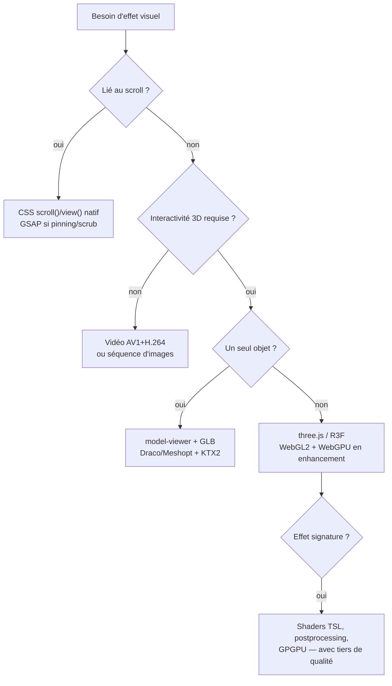

# 3D et VFX avancés en frontend web — démystification

> Rapport de recherche pour un futur skill de design de sites intégrant la 3D
> et les effets visuels avancés. Sources primaires en priorité : MDN, specs
> W3C, threejs.org, npm/GitHub, gsap.com, web.dev, modelviewer.dev, caniuse.
> Recherche réalisée le 22 juillet 2026. Les versions npm ont été vérifiées
> directement via `npm view` à cette date.

## Résumé exécutif

La 3D et les VFX web ne forment pas un bloc monolithique mais une **échelle de
techniques** (ladder), du moins cher au plus cher en implémentation, en
performance et en risque d'accessibilité :

1. **Parallax et scroll-driven animation** — désormais natif en CSS, quasi
   gratuit en runtime.
2. **Vidéo et cinematics** — la "fausse 3D" pré-rendue, souvent le meilleur
   rapport effet/coût.
3. **Objet 3D isolé dans une page 2D** — `<model-viewer>` + glTF compressé,
   coût maîtrisé.
4. **VFX avancés (shaders, post-processing, particles)** — expertise GLSL/TSL
   requise, coût GPU réel.
5. **Site entièrement 3D** — three.js/R3F, le haut de l'échelle : budget de
   scène, fallbacks et équipe dédiés.

La règle structurante qui ressort des sources : **monter d'un barreau doit
être justifié par le contenu** (produit à examiner sous tous les angles,
donnée spatiale, narration), jamais par la seule envie décorative. Chaque
barreau supérieur exige explicitement : gestion de `prefers-reduced-motion`
([MDN](https://developer.mozilla.org/en-US/docs/Web/CSS/Reference/At-rules/@media/prefers-reduced-motion)),
fallback statique, et contenu lisible sans WebGL.

Faits marquants 2025–2026 :

- **GSAP est 100 % gratuit depuis la 3.13** (avril 2025), plugins Club inclus
  (ScrollTrigger, SplitText, MorphSVG…), usage commercial couvert, financé par
  Webflow ([gsap.com/blog/3-13](https://gsap.com/blog/3-13/)).
- **Les scroll-driven animations CSS deviennent interopérables** : Chrome 115+,
  Safari 26+, Firefox 155+ ; ~84 % d'usage global
  ([caniuse](https://caniuse.com/mdn-css_properties_animation-timeline_scroll)).
- **WebGPU est shipped partout mais partiellement** : Chrome/Edge 113+ (2023),
  Safari/iOS 26 (2025), Firefox 141 sur Windows uniquement (juillet 2025,
  autres OS en cours) ([Mozilla Gfx](https://mozillagfx.wordpress.com/2025/07/15/shipping-webgpu-on-windows-in-firefox-141/),
  [caniuse](https://caniuse.com/webgpu)). **WebGL2 reste la baseline de
  production ; WebGPU est un progressive enhancement.**

---

## Le concept d'échelle (ladder)

Chaque barreau est évalué sur quatre axes :

| Axe | Question |
| --- | --- |
| Coût d'implémentation | Compétences et outillage requis, état de l'art 2025–2026 |
| Budget performance | Poids bundle, coût GPU/batterie, impact Core Web Vitals (LCP/INP) |
| Accessibilité et résilience | `prefers-reduced-motion`, fallbacks, progressive enhancement |
| Quand c'est *earned* | Critères de décision encodables dans un skill |

L'ordre de présentation ci-dessous suit la commande (du plus lourd au plus
léger pour les sections 1–2, puis les techniques 2D), mais la **logique de
décision d'un skill devrait parcourir l'échelle dans l'autre sens** : commencer
par CSS/vidéo et ne monter que si le besoin le justifie.

---

## 1. Sites entièrement 3D

### WebGL vs WebGPU — état des lieux

| API | Support (juillet 2026) | Statut |
| --- | --- | --- |
| WebGL 2 | Tous les navigateurs evergreen | Baseline de production |
| WebGPU | Chrome/Edge 113+, Opera 99+, Safari 26+ (macOS/iOS/visionOS 26), Firefox 141+ **Windows seulement**, Samsung Internet 24+ ; ~83–84 % global | Progressive enhancement |

Sources : [caniuse WebGPU](https://caniuse.com/webgpu),
[Mozilla Gfx Team — Shipping WebGPU on Windows in Firefox 141](https://mozillagfx.wordpress.com/2025/07/15/shipping-webgpu-on-windows-in-firefox-141/),
[gpuweb Implementation Status](https://github.com/gpuweb/gpuweb/wiki/Implementation-Status).

**Conflit de sources à noter** : caniuse marque Firefox desktop "disabled by
default" alors que Mozilla a shipped WebGPU par défaut dans Firefox 141 — mais
uniquement sur Windows ; caniuse ne distingue pas par OS. Mozilla annonce
macOS/Linux "in the coming months", puis Android
([Mozilla Gfx](https://mozillagfx.wordpress.com/2025/07/15/shipping-webgpu-on-windows-in-firefox-141/)).
Conclusion pratique : **toute scène doit fonctionner en WebGL2**, WebGPU étant
détecté à runtime (three.js `WebGPURenderer` retombe automatiquement sur
WebGL2).

### Outillage 2025–2026

| Outil | Version vérifiée (npm, 2026-07-22) | Rôle |
| --- | --- | --- |
| [three](https://www.npmjs.com/package/three) | 0.185.1 (r185) | Moteur de rendu, deux renderers : `WebGLRenderer` et `WebGPURenderer` + TSL |
| [@react-three/fiber](https://www.npmjs.com/package/@react-three/fiber) | 9.6.1 (v10 en canary) | Reconciler React déclaratif pour three.js |
| [@react-three/drei](https://www.npmjs.com/package/@react-three/drei) | 10.7.7 | Helpers (loaders, controls, staging, `<Text>`…) |
| [Spline](https://spline.design/3d-design) | SaaS + [react-spline](https://github.com/splinetool/react-spline) | Éditeur 3D no-code, export runtime WebGL |

Spline est l'option "designer-first" : rapide à produire, mais le runtime et la
scène s'ajoutent au bundle et le rendu WebGL peut être lourd sur vieux devices ;
Spline documente lui-même l'export **image ou vidéo** comme alternative quand la
3D temps réel n'est pas indispensable
([react-spline README](https://github.com/splinetool/react-spline)). Taille
précise du runtime : non documentée officiellement — donnée indisponible.

### Budget performance

- **Bundle** : `three.module.js` pèse ~**155 KB gzippé** et le tree-shaking de
  three.js est notoirement limité (classes fortement couplées) ; les gains
  passent surtout par la découpe des addons (`examples/jsm`) importés à l'unité
  ([forum three.js — Tree Shaking](https://discourse.threejs.org/t/tree-shaking-three-js/1349),
  [state of tree-shaking](https://discourse.threejs.org/t/what-is-the-state-of-tree-shaking/33168)).
  Taille du `WebGPURenderer` seul : non trouvée dans une source fiable — donnée
  indisponible, à mesurer par bundle analysis au cas par cas.
- **Device pixel ratio** : capper à 2 —
  `renderer.setPixelRatio(Math.min(window.devicePixelRatio, 2))` — les écrans
  3x coûtent ~2,25× plus de fragments pour un gain imperceptible ; pattern
  standard des guides de performance three.js
  ([r3f — Scaling performance](https://r3f.docs.pmnd.rs/advanced/scaling-performance)).
- **LCP** : les candidats LCP listés par web.dev sont les images, les blocs de
  texte, les background-images `url()` et le poster/première frame d'une
  `<video>` — un hero entièrement en `<canvas>` laisse le LCP se mesurer sur un
  élément incident et retarde le rendu perçu ; prévoir un poster/DOM réel
  au-dessus du canvas ([web.dev — LCP](https://web.dev/articles/lcp)).
- **INP / main thread** : `OffscreenCanvas` +
  `canvas.transferControlToOffscreen()` permet de déplacer le rendu dans un
  worker et de garder le main thread réactif ; **Baseline "widely available"
  depuis mars 2023** ([MDN OffscreenCanvas](https://developer.mozilla.org/en-US/docs/Web/API/OffscreenCanvas),
  [web.dev — OffscreenCanvas](https://web.dev/articles/offscreen-canvas)).
  Attention : le [manuel three.js](https://threejs.org/manual/en/offscreencanvas.html)
  décrit le pattern (avec fallback main-thread) mais sa note "Chrome only" est
  obsolète face au Baseline MDN. Limite : les events (pointer, resize) doivent
  être relayés au worker par `postMessage`.
- **Batterie/GPU** : arrêter la render loop hors viewport
  (`IntersectionObserver`) et quand l'onglet est caché ; rendu "on demand"
  plutôt que loop permanente (recommandé par
  [r3f — Scaling performance](https://r3f.docs.pmnd.rs/advanced/scaling-performance),
  `frameloop="demand"`).

### Accessibilité et résilience

- **Détection d'échec** : créer le context avec
  `failIfMajorPerformanceCaveat: true` pour détecter le software rendering et
  basculer sur le fallback statique
  ([three.js PR #16102](https://github.com/mrdoob/three.js/pull/16102)) ;
  écouter `webglcontextlost` (Chrome limite ~16 contexts WebGL simultanés par
  page, [MDN WEBGL_lose_context](https://developer.mozilla.org/en-US/docs/Web/API/WEBGL_lose_context/loseContext)).
- **Contenu** : le canvas est invisible pour les screen readers et les moteurs
  de recherche ; tout contenu porteur de sens (texte, CTA, navigation) doit
  exister en DOM réel, le canvas n'étant qu'une couche de présentation
  (progressive enhancement).
- **Motion** : caméra qui bouge + scroll détourné = déclencheurs vestibulaires
  documentés (vertiges, nausées) ; `prefers-reduced-motion: reduce` doit figer
  la caméra ou servir une image statique
  ([web.dev — prefers-reduced-motion](https://web.dev/articles/prefers-reduced-motion),
  [MDN](https://developer.mozilla.org/en-US/docs/Web/CSS/Reference/At-rules/@media/prefers-reduced-motion)).

### Quand c'est earned

| Earned | Décoratif (à éviter ou descendre l'échelle) |
| --- | --- |
| Le produit/donnée est intrinsèquement spatial (configurateur, visualisation, jeu, portfolio d'artiste 3D) | Hero 3D "parce que c'est joli" sur un site de contenu |
| L'utilisateur interagit avec la scène (orbite, configure, explore) | Scène en autoplay que l'utilisateur ne peut pas contrôler |
| L'équipe peut tenir le budget : fallback, QA multi-device, maintenance des versions three | Pas de budget QA mobile ni de fallback prévu |

---

## 2. Objets 3D isolés dans une page 2D

Le barreau intermédiaire : un seul modèle interactif (produit, mascotte,
illustration) dans une page HTML classique.

### `<model-viewer>` et formats

[`<model-viewer>`](https://modelviewer.dev/) (Google,
[@google/model-viewer](https://www.npmjs.com/package/@google/model-viewer)
**4.3.1**, vérifié npm 2026-07-22) est un web component qui embarque three.js
et expose la 3D en attributs HTML :

- `src` : **glTF/GLB**, le standard Khronos, "the JPEG of 3D", premier format à
  standardiser le PBR ([modelviewer.dev FAQ](https://modelviewer.dev/docs/faq.html),
  [Khronos glTF](https://www.khronos.org/gltf/)).
- `ios-src` : **USDZ** pour Quick Look sur iOS ; depuis la v1.7,
  `<model-viewer>` sait aussi **générer l'USDZ à la volée** au clic AR
  ([Khronos news](https://www.khronos.org/news/permalink/model-viewer-1.7-released-with-auto-generation-of-usdz-on-the-fly)).
- Trois AR modes : WebXR (Android, défaut), Scene Viewer, Quick Look (iOS)
  ([Google ARCore docs](https://developers.google.com/ar/develop/webxr/model-viewer)).
- **Lazy loading intégré** : `poster` (image affichée avant le modèle),
  `loading="lazy"`, `reveal="interaction"` (ne charge le GLB qu'à
  l'interaction) — le poster sert de fallback statique naturel et de candidat
  LCP ([modelviewer.dev — Loading](https://modelviewer.dev/docs/)).

### Compression des assets

Pipeline de référence : [glTF Transform](https://gltf-transform.dev/) (CLI ou
API).

| Technique | Compresse | Note |
| --- | --- | --- |
| **Draco** | Géométrie | Décodeur WASM à charger côté client |
| **Meshopt** (`EXT_meshopt_compression`) | Géométrie + morph targets + animations | Décodeur plus léger que Draco |
| **KTX2 / Basis Universal** | Textures (restent compressées en VRAM) | Deux codecs : **ETC1S** (très compact, qualité moindre) et **UASTC** (qualité, fichiers plus lourds) |

Exemple mesuré sur DamagedHelmet (5,03 MB source) : Draco 3,29 MB, Meshopt
3,4 MB, KTX2 ETC1S 2,65 MB, KTX2 UASTC 13,44 MB — l'UASTC se paie en poids
fichier mais économise la VRAM
([gltf-transform](https://gltf-transform.dev/), exemple chiffré relayé par
[axl-devhub — Optimizing 3D Models](https://www.axl-devhub.me/en/blog/optimizing-3d-models),
source secondaire).

### Budget, accessibilité, décision

- **Ordre de grandeur cible** : un modèle produit optimisé devrait rester
  autour de 1–3 MB (GLB Draco/Meshopt + KTX2) ; au-delà, préférer
  `reveal="interaction"` pour ne rien coûter au chargement initial.
- `<model-viewer>` embarquant three.js, son coût JS est proche du barreau 1 ;
  il se charge en module async non bloquant.
- **Accessibilité** : fournir `alt` sur `<model-viewer>` (lu par les screen
  readers) et le `poster` comme équivalent visuel statique
  ([modelviewer.dev](https://modelviewer.dev/)).
- **Earned quand** : l'objet gagne à être manipulé (e-commerce, AR "voir chez
  soi", pièce technique). **Décoratif quand** : le modèle tourne en boucle sans
  interaction — une vidéo ou une séquence d'images rend le même service pour
  une fraction du coût (voir barreau 3).

---

## 3. Vidéo et cinematics

La vidéo est la "3D pré-rendue" : rendu AAA garanti, décodage hardware, zéro
risque de frame drop lié au device.

### Codecs

Recommandation MDN pour un site web typique
([MDN — Web video codec guide](https://developer.mozilla.org/en-US/docs/Web/Media/Guides/Formats/Video_codecs)) :

| Priorité | Codec / container | Support | Note |
| --- | --- | --- | --- |
| 1 | **AV1** + Opus / WebM | Chrome 70+, Firefox 67+, Edge 121+, Safari 17+ **hardware only** | Royalty-free, ~50 % plus efficace que H.264 |
| Fallback | **H.264 (AVC)** + AAC / MP4 | Tous les navigateurs | Le seul universel ; propriétaire |
| Option | **VP9** / WebM | Très large hors vieux Safari | Royalty-free, intermédiaire |
| Cas limité | **HEVC (H.265)** | Safari + support partiel ailleurs (hardware) | Licensing complexe, à réserver aux pipelines Apple |

Point critique Safari/AV1 : **Apple ne fournit pas de décodeur AV1 logiciel** ;
seuls les devices avec décodeur hardware lisent l'AV1 (M3+, iPhone 15 Pro+,
iPad M4+) — d'où des taux de sessions Safari compatibles encore minoritaires
([Bitmovin — Apple AV1 Support](https://bitmovin.com/blog/apple-av1-support/),
[MDN codec guide](https://developer.mozilla.org/en-US/docs/Web/Media/Guides/Formats/Video_codecs)).
**Toujours servir plusieurs `<source>` avec MP4/H.264 en dernier.**

### Autoplay policies

Les navigateurs bloquent l'autoplay avec audio ; la combinaison requise pour
un autoplay fiable, mobile inclus
([MDN — Autoplay guide](https://developer.mozilla.org/en-US/docs/Web/Media/Guides/Autoplay),
[MDN — `<video>`](https://developer.mozilla.org/en-US/docs/Web/HTML/Reference/Elements/video)) :

```html
<video autoplay muted playsinline loop poster="poster.avif" preload="metadata">
```

- `muted` : "muted autoplay is always allowed" (MDN).
- `playsinline` : requis par iOS Safari pour éviter le passage en plein écran.
- `poster` : sert de fallback visuel **et** de candidat LCP (le poster d'une
  `<video>` est explicitement listé, [web.dev — LCP](https://web.dev/articles/lcp)).
- `preload="metadata"` (ou `none` + lazy) pour ne pas télécharger la vidéo hors
  viewport.

### Scroll-driven / scrubbed video

Deux techniques pour le pattern "Apple AirPods" (l'animation avance avec le
scroll) — sources secondaires (blogs techniques), pas de doc de plateforme
dédiée :

1. **`video.currentTime` piloté par le scroll** : simple, mais saccadé si la
   vidéo n'est pas encodée **tout en keyframes** (delta frames = seek lent) ;
   ré-encoder avec un keyframe interval de 1 et une vidéo courte
   ([muffinman.io — Scrubbing videos](https://muffinman.io/blog/scrubbing-videos-using-javascript/),
   [ghosh.dev — Video scrubbing animations](https://www.ghosh.dev/posts/playing-with-video-scrubbing-animations-on-the-web/)).
2. **Séquence d'images sur canvas** : la plus fiable en avant/arrière (pattern
   Apple), au prix d'un poids réseau élevé — à réserver au desktop, avec
   variante mobile allégée ([ghosh.dev](https://www.ghosh.dev/posts/playing-with-video-scrubbing-animations-on-the-web/)).

Le driver de scroll peut être GSAP ScrollTrigger (`scrub`) ou, en progressive
enhancement, `animation-timeline` CSS (voir barreau 4).

### Accessibilité et décision

- `prefers-reduced-motion` : ne pas autoplay ; afficher le poster et un bouton
  play ([web.dev — prefers-reduced-motion](https://web.dev/articles/prefers-reduced-motion)).
- Captions/transcript si la vidéo porte du sens ; purement décorative → vidéo
  sans information indispensable.
- **Earned quand** : narration produit, démonstration de mouvement, hero
  cinématique où le rendu doit être parfait sur tous les devices. C'est le
  **substitut recommandé** aux barreaux 1–2 quand l'interactivité n'est pas
  nécessaire : qualité AAA, coût runtime minimal, décodage hardware.

---

## 4. Parallax et scroll-driven animation

### CSS natif : le nouveau défaut

Le module CSS scroll-driven animations lie une animation CSS/WAAPI à la
progression du scroll au lieu du temps
([MDN — Scroll-driven animations](https://developer.mozilla.org/en-US/docs/Web/CSS/Guides/Scroll-driven_animations),
spec : [W3C Scroll-driven Animations](https://www.w3.org/TR/scroll-animations-1/)) :

- `animation-timeline: scroll()` — progression d'un scroll container ;
- `animation-timeline: view()` — progression de visibilité d'un élément dans le
  viewport (remplace l'usage d'IntersectionObserver pour les reveals) ;
- `scroll-timeline` / `view-timeline` (timelines nommées), `animation-range`,
  `timeline-scope`.

**Support** (juillet 2026) : Chrome/Edge 115+, Opera 101+, Safari 26+ (macOS,
iOS), **Firefox 155+**, ~**84 % global**
([caniuse](https://caniuse.com/mdn-css_properties_animation-timeline_scroll),
[WebKit — A guide to Scroll-driven Animations](https://webkit.org/blog/17101/a-guide-to-scroll-driven-animations-with-just-css/)).
Ces animations tournent hors main thread quand la propriété animée est
compositable (`transform`, `opacity`), d'où un coût INP quasi nul — c'est
l'argument central du billet WebKit. Le pattern robuste : effet dans un bloc
`@supports (animation-timeline: scroll())`, page parfaitement utilisable sans.

### GSAP + ScrollTrigger

- **Licensing (fait notable 2025)** : depuis la **3.13** (avril 2025), suite à
  l'acquisition de GreenSock par **Webflow** (octobre 2024), GSAP et **tous**
  les plugins ex-Club (ScrollTrigger, ScrollSmoother, SplitText, MorphSVG,
  DrawSVG, Inertia…) sont gratuits, **usage commercial inclus**, distribués sur
  le npm public ([gsap.com/blog/3-13](https://gsap.com/blog/3-13/),
  [Webflow blog](https://webflow.com/blog/gsap-becomes-free)). Version courante :
  **3.15.0** (npm, 2026-07-22).
- ScrollTrigger reste l'outil pour ce que le CSS natif ne fait pas : `scrub`
  avec inertie, pinning complexe, timelines orchestrées, snap, callbacks JS.
  Coût : JS sur le main thread (impact INP potentiel si les handlers sont
  lourds), ~30–40 KB min+gzip core + plugin.

### Lenis et View Transitions

- **[Lenis](https://github.com/darkroomengineering/lenis)** (darkroom.engineering,
  **1.3.25**) : smooth scroll qui **wrappe le scroll natif** — `position:
  sticky`, ancres et accessibilité continuent de fonctionner, et il expose une
  boucle unique pour synchroniser WebGL/ScrollTrigger
  ([lenis.dev](https://www.lenis.dev/)). Reste une altération du scroll
  utilisateur : à désactiver sous `prefers-reduced-motion` et à éviter sur les
  sites de contenu dense.
- **[View Transitions API](https://developer.mozilla.org/en-US/docs/Web/API/View_Transition_API)** :
  same-document supporté Chrome 111+, Safari 18+, Firefox 133+ ;
  **cross-document** (transitions MPA) Chromium + Safari 18.2+, Firefox en
  cours d'implémentation (MDN). API conçue comme progressive enhancement : sans
  support, la navigation fonctionne simplement sans transition.

### Accessibilité et décision

- Le parallax est un déclencheur vestibulaire documenté (éléments à vitesses
  différentes → vertiges, nausées) ; WCAG 2.3.3 "Animation from Interactions"
  demande de pouvoir désactiver le motion non essentiel
  ([web.dev — prefers-reduced-motion](https://web.dev/articles/prefers-reduced-motion),
  [W3C WCAG 2.1 — 2.3.3](https://www.w3.org/TR/WCAG21/#animation-from-interactions)).
- **Earned quand** : hiérarchiser une narration longue (storytelling produit),
  donner du feedback de progression. **Décoratif quand** : chaque section a son
  reveal "parce que la lib est là" — le CSS natif rend ce barreau si bon marché
  que le risque principal est désormais la surenchère, pas le coût technique.
- Règle de choix encodable : **CSS `scroll()`/`view()` d'abord ; GSAP
  ScrollTrigger seulement pour pinning/scrub/orchestration ; Lenis seulement
  si un rendu WebGL doit être synchronisé au scroll.**

---

## 5. VFX avancés (shaders, post-processing, particles, texte WebGL)

Le barreau expert — chaque technique suppose déjà une scène three.js (barreau 1
ou 2) et une compétence shader.

### Shaders custom (GLSL / TSL)

- WebGL : `ShaderMaterial`/`RawShaderMaterial` ou injection dans les materials
  standard via `onBeforeCompile`
  ([three.js docs — ShaderMaterial](https://threejs.org/docs/#api/en/materials/ShaderMaterial)).
- WebGPU : three.js pousse **TSL (Three.js Shading Language)**, un DSL
  JavaScript node-based qui compile vers WGSL **et** GLSL — le code shader
  écrit en TSL fonctionne sur les deux renderers, c'est la voie de migration
  officielle ([three.js — TSL wiki](https://github.com/mrdoob/three.js/wiki/Three.js-Shading-Language)).
- Usages typiques earned : distortion/displacement au hover, transitions
  d'images (displacement maps), materials de marque impossibles en CSS.

### Post-processing

- Lib de référence : [pmndrs/postprocessing](https://github.com/pmndrs/postprocessing)
  (**6.39.3**, release GitHub du 2026-07-18) — contrairement à
  l'`EffectComposer` des addons three.js (une passe = un render), elle **fusionne
  plusieurs effects en un seul shader/passe** (`EffectPass`), réduisant
  drastiquement le coût fillrate ([README](https://github.com/pmndrs/postprocessing)).
- Wrapper R3F : `@react-three/postprocessing`.
- Coût : chaque passe plein écran se multiplie par le pixel ratio — c'est ici
  que le cap DPR à 2 (voire 1.5 mobile) devient critique. Bloom, DoF et SSAO
  sont les plus chers ; sur mobile, se limiter à 1 `EffectPass` fusionnée.

### Particles GPGPU

- WebGL : `GPUComputationRenderer` (addon three.js) — la simulation vit dans
  des textures ping-pong, le CPU n'itère jamais sur les particules
  ([exemples threejs.org](https://threejs.org/examples/?q=gpgpu)).
- WebGPU : **compute shaders TSL**, accès mémoire arbitraire en parallèle,
  gains d'un ordre de grandeur pour les grosses simulations — le cas d'usage
  vitrine de WebGPU ([three.js WebGPU examples](https://threejs.org/examples/?q=webgpu),
  [Maxime Heckel — Field Guide to TSL and WebGPU](https://blog.maximeheckel.com/posts/field-guide-to-tsl-and-webgpu/),
  source secondaire experte).
- Contrainte : prévoir un tier mobile (10–50k particules) vs desktop (500k+),
  et un fallback sans particules.

### Texte en WebGL

- [troika-three-text](https://www.npmjs.com/package/troika-three-text)
  (**0.52.4**) : rendu texte **SDF** de haute qualité dans three.js ; parse
  directement les .ttf/.otf/.woff et génère l'atlas SDF **dans un web worker**
  (pas de frame drop) ([troika docs](https://protectwise.github.io/troika/troika-three-text/)).
  C'est ce que drei utilise sous son composant `<Text>`.
- Alternative : atlas **MSDF** pré-générés (multi-channel SDF, coins plus nets
  à grande taille), pipeline plus manuel.
- **Règle d'accessibilité clé : le texte WebGL n'existe ni pour les screen
  readers, ni pour le SEO, ni pour la sélection/copie.** Tout texte porteur de
  sens doit être du DOM ; le texte WebGL est réservé au décoratif ou doublé
  d'un équivalent DOM (visually hidden).

### Décision

**Earned quand** : l'effet est la signature du site (studio créatif, campagne,
awwwards-like) et l'équipe a la compétence shader en interne. **Décoratif
quand** : un filtre CSS (`filter`, `backdrop-filter`, `mix-blend-mode`) ou une
vidéo produit le même effet perçu. Chaque effet doit avoir un kill switch :
`prefers-reduced-motion`, tier mobile, et suppression pure si
`failIfMajorPerformanceCaveat` échoue.

---

## Implications pour un futur skill

### 1. L'arbre de décision (du bas vers le haut de l'échelle)



### 2. Critères "earned" encodables

| Critère | La 3D/VFX est earned si… |
| --- | --- |
| Contenu | Le sujet est spatial ou le mouvement EST le message (produit, donnée, narration) |
| Interaction | L'utilisateur manipule (orbite, configure, explore) — sinon vidéo |
| Marque | Le site est lui-même le portfolio/la démonstration (studio, campagne) |
| Équipe | Budget QA multi-device + maintenance (three.js release ~mensuelle, breaking changes réguliers) |

### 3. Budgets par défaut à encoder

| Poste | Budget |
| --- | --- |
| JS 3D initial | three.js ≈ 155 KB gzip incompressible → charger la scène en dynamic import, jamais dans le bundle critique |
| Modèle GLB | ~1–3 MB compressé (Draco/Meshopt + KTX2 ETC1S), `poster` + lazy reveal |
| Pixel ratio | `min(devicePixelRatio, 2)`, 1.5 en mobile si post-processing |
| Render loop | On demand ou stoppée hors viewport / onglet caché |
| LCP | Toujours un candidat LCP réel (poster, image, texte) au-dessus/à la place du canvas au premier paint |
| Main thread | OffscreenCanvas en worker si la scène est lourde (Baseline depuis 2023) |

### 4. Fallbacks obligatoires (non négociables)

1. **`prefers-reduced-motion: reduce`** → pas d'autoplay, pas de parallax, pas
   de caméra animée ; version statique ou dissolves.
2. **WebGL indisponible/software** (`failIfMajorPerformanceCaveat`,
   `webglcontextlost`) → image/vidéo statique, contenu intact.
3. **Contenu porteur de sens toujours en DOM** : texte, CTA, navigation jamais
   uniquement en canvas/WebGL.
4. **Vidéo** : `muted playsinline` + `poster` + fallback H.264/MP4.
5. **CSS scroll-driven** : derrière `@supports`, page fonctionnelle sans.
6. **WebGPU** : jamais requis ; détection runtime avec fallback WebGL2.

### 5. Points de veille (à re-vérifier à la rédaction du skill)

- Firefox WebGPU macOS/Linux/Android (annoncé "coming months",
  [Mozilla Gfx](https://mozillagfx.wordpress.com/2025/07/15/shipping-webgpu-on-windows-in-firefox-141/)).
- R3F v10 (en canary au moment de la recherche).
- Cross-document View Transitions dans Firefox (en cours,
  [MDN](https://developer.mozilla.org/en-US/docs/Web/API/View_Transition_API)).
- Part de sessions Safari décodant l'AV1 (croît avec le renouvellement hardware).

---

## Sources

### Docs de plateforme et specs
- [MDN — CSS scroll-driven animations](https://developer.mozilla.org/en-US/docs/Web/CSS/Guides/Scroll-driven_animations) · [W3C Scroll-driven Animations Level 1](https://www.w3.org/TR/scroll-animations-1/)
- [WebKit blog — A guide to Scroll-driven Animations with just CSS](https://webkit.org/blog/17101/a-guide-to-scroll-driven-animations-with-just-css/)
- [MDN — View Transition API](https://developer.mozilla.org/en-US/docs/Web/API/View_Transition_API)
- [MDN — Autoplay guide](https://developer.mozilla.org/en-US/docs/Web/Media/Guides/Autoplay) · [MDN — `<video>`](https://developer.mozilla.org/en-US/docs/Web/HTML/Reference/Elements/video) · [MDN — Web video codec guide](https://developer.mozilla.org/en-US/docs/Web/Media/Guides/Formats/Video_codecs)
- [MDN — prefers-reduced-motion](https://developer.mozilla.org/en-US/docs/Web/CSS/Reference/At-rules/@media/prefers-reduced-motion) · [W3C WCAG 2.1 — 2.3.3](https://www.w3.org/TR/WCAG21/#animation-from-interactions)
- [MDN — OffscreenCanvas](https://developer.mozilla.org/en-US/docs/Web/API/OffscreenCanvas) · [MDN — WEBGL_lose_context](https://developer.mozilla.org/en-US/docs/Web/API/WEBGL_lose_context/loseContext)
- [caniuse — WebGPU](https://caniuse.com/webgpu) · [caniuse — animation-timeline: scroll()](https://caniuse.com/mdn-css_properties_animation-timeline_scroll)
- [Mozilla Gfx — Shipping WebGPU on Windows in Firefox 141](https://mozillagfx.wordpress.com/2025/07/15/shipping-webgpu-on-windows-in-firefox-141/) · [gpuweb — Implementation Status](https://github.com/gpuweb/gpuweb/wiki/Implementation-Status)
- [web.dev — LCP](https://web.dev/articles/lcp) · [web.dev — prefers-reduced-motion](https://web.dev/articles/prefers-reduced-motion) · [web.dev — OffscreenCanvas](https://web.dev/articles/offscreen-canvas)

### Librairies et outils (versions vérifiées via npm/GitHub le 2026-07-22)
- [three](https://www.npmjs.com/package/three) 0.185.1 · [manuel OffscreenCanvas](https://threejs.org/manual/en/offscreencanvas.html) · [TSL wiki](https://github.com/mrdoob/three.js/wiki/Three.js-Shading-Language) · [PR failIfMajorPerformanceCaveat](https://github.com/mrdoob/three.js/pull/16102) · [forum — tree-shaking](https://discourse.threejs.org/t/tree-shaking-three-js/1349)
- [@react-three/fiber](https://www.npmjs.com/package/@react-three/fiber) 9.6.1 · [@react-three/drei](https://www.npmjs.com/package/@react-three/drei) 10.7.7 · [r3f — Scaling performance](https://r3f.docs.pmnd.rs/advanced/scaling-performance)
- [modelviewer.dev](https://modelviewer.dev/) · [@google/model-viewer](https://www.npmjs.com/package/@google/model-viewer) 4.3.1 · [Khronos — USDZ à la volée](https://www.khronos.org/news/permalink/model-viewer-1.7-released-with-auto-generation-of-usdz-on-the-fly) · [Khronos glTF](https://www.khronos.org/gltf/) · [glTF Transform](https://gltf-transform.dev/)
- [GSAP 3.13 — gratuité](https://gsap.com/blog/3-13/) (gsap 3.15.0) · [Webflow blog](https://webflow.com/blog/gsap-becomes-free)
- [Lenis](https://github.com/darkroomengineering/lenis) 1.3.25 · [lenis.dev](https://www.lenis.dev/)
- [pmndrs/postprocessing](https://github.com/pmndrs/postprocessing) 6.39.3 · [troika-three-text](https://www.npmjs.com/package/troika-three-text) 0.52.4 ([docs](https://protectwise.github.io/troika/troika-three-text/))
- [Spline](https://spline.design/3d-design) · [react-spline](https://github.com/splinetool/react-spline)

### Sources secondaires (signalées comme telles dans le texte)
- [Bitmovin — Apple AV1 Support](https://bitmovin.com/blog/apple-av1-support/)
- [muffinman.io — Scrubbing videos](https://muffinman.io/blog/scrubbing-videos-using-javascript/) · [ghosh.dev — Video scrubbing animations](https://www.ghosh.dev/posts/playing-with-video-scrubbing-animations-on-the-web/)
- [axl-devhub — Optimizing 3D Models (chiffres Draco/KTX2)](https://www.axl-devhub.me/en/blog/optimizing-3d-models)
- [Maxime Heckel — Field Guide to TSL and WebGPU](https://blog.maximeheckel.com/posts/field-guide-to-tsl-and-webgpu/)
