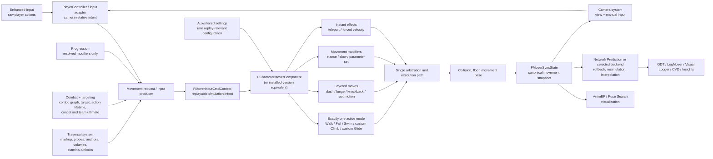

# Character Controller: AAA Practices for an Unreal Mover-First Refactor

## Scope and evidence policy

This is the standalone research deliverable requested before the refactor. It is
not part of the skill's progressive-disclosure runtime; `SKILL.md` and its linked
topical references contain the distilled public contract.

This report informs the refactor of the public `character-controller` skill. The
pre-research grilling supplied these provisional directions for evaluation:

- public and reusable rather than project-specific;
- Unreal-first;
- separate `design`, `build`, and `diagnose` branches;
- Mover-first;
- based on the Default Character Movement Set, extended rather than rebuilt;
- Genshin Impact as a locomotion and exploration design reference;
- Granblue Fantasy: Relink as a combat design reference;
- Wakfu-like progression outside the controller.

They are not treated as evidence-backed production decisions. Every direction
remains subject to the gates and unresolved choices documented below; in
particular, Mover-first requires an explicit shipping-risk decision.

Only primary sources support engine and production claims: Epic documentation,
Epic API/source-derived documentation and samples, and material published by the
studios that own the referenced games.

Labels used below:

- **Fact**: directly established by a primary source.
- **Version-sensitive fact**: established for a documented engine version, but
  names, behavior, or maturity may change.
- **Recommendation**: an inference for the future skill, derived from the facts
  and the stated game direction.

## Executive summary

1. **Mover-first is a direction, not a maturity claim.** Epic intends Mover to
   succeed CMC, but the current public documentation still labels it
   `Experimental`, warns that features are incomplete, and says APIs and data
   formats may change. The skill must open every `design` or `build` invocation
   with an installed-engine version and capability gate. It must not describe
   Mover as production-proven. [Epic: Mover](https://dev.epicgames.com/documentation/en-us/unreal-engine/mover-in-unreal-engine)

2. **Use the engine's character specialization and Default Set.** Prefer
   `UCharacterMoverComponent`, when present in the installed version, over a
   hand-built solver on `UMoverComponent`. It is the documented classic-character
   specialization. The Default Character Movement Set supplies the CMC-like base
   and accepts replacement or extension of individual modes. Do not recreate
   walking, falling, floor handling, or basing before proving a missing project
   requirement. [Epic: `UCharacterMoverComponent`](https://dev.epicgames.com/documentation/unreal-engine/API/Plugins/Mover/UCharacterMoverComponent),
   [Epic: Mover concepts](https://dev.epicgames.com/documentation/unreal-engine/mover-features-and-concepts-in-unreal-engine)

3. **Mover is the single movement authority.** Raw input, traversal, combat,
   animation, camera, and progression may request or influence movement, but none
   may write the pawn transform or canonical velocity directly. Persistent motion
   belongs in a movement mode, temporary displacement in a layered move, parameter
   changes in a movement modifier, and atomic changes such as teleport or forced
   velocity in an instant effect. The active mode performs collision-constrained
   execution. [Epic: Mover concepts](https://dev.epicgames.com/documentation/unreal-engine/mover-features-and-concepts-in-unreal-engine),
   [Epic: `UMoverComponent`](https://dev.epicgames.com/documentation/en-us/unreal-engine/API/Plugins/Mover/UMoverComponent)

4. **Make rollback-safe state a day-one constraint.** Produce one simulation
   command from all relevant player and gameplay intents; keep canonical,
   frequently changing state in sync state; keep rare simulation inputs in aux
   state where the installed API still uses that concept. Never read raw device,
   camera, animation, wall-clock, or mutable gameplay state during resimulation.
   Mover's public model sends authored inputs to the server on a shared timeline,
   then uses authoritative state for client rollback and resimulation.
   [Epic: Mover versus CMC](https://dev.epicgames.com/documentation/unreal-engine/comparing-mover-and-character-movement-component-in-unreal-engine),
   [Epic: `FMoverInputCmdContext`](https://dev.epicgames.com/documentation/en-us/unreal-engine/API/Plugins/Mover/FMoverInputCmdContext),
   [Epic: `FMoverSyncState`](https://dev.epicgames.com/documentation/en-us/unreal-engine/API/Plugins/Mover/FMoverSyncState),
   [Epic: `FMoverAuxStateContext`](https://dev.epicgames.com/documentation/en-us/unreal-engine/API/Plugins/Mover/FMoverAuxStateContext)

5. **Adopt a split traversal boundary.** `traversal-system` should own world
   affordance data, candidate discovery, anchors, volumes, route/readability
   markup, stamina economy, and unlock rules. `character-controller` should own
   execution of the accepted movement mode, collision, contact revalidation,
   transitions caused by physical state, and the final displacement. This mirrors
   Epic's Smart Object separation: world objects provide searchable interaction
   data but do not contain the interactor's execution logic.
   [Epic: Smart Objects](https://dev.epicgames.com/documentation/unreal-engine/smart-objects-in-unreal-engine---overview)

6. **Combat owns action lifetime; movement owns action displacement.** The combo
   graph, link or team-ultimate orchestration, target selection, costs, cancel
   windows, and ability lifetime do not belong in the controller. Each combat
   action submits a movement contract: facing policy, locomotion policy,
   displacement source, collision policy, and cancellation result. Mover executes
   dash, lunge, knockback, root motion, or motion-warped movement through its own
   primitives. Relink's official material establishes party Link Attacks and
   chained Skybound Arts, but publishes no player-controller architecture.
   [Cygames: Relink gameplay](https://relink.granbluefantasy.jp/en/gameplay),
   [Epic: Mover layered root motion](https://dev.epicgames.com/documentation/en-us/unreal-engine/API/Plugins/Mover/FLayeredMove_AnimRootMotion)

7. **Animation is an observer except through an explicit movement route.** An
   AnimBP may select and render poses from movement state and trajectory. Root
   motion is admitted only as a Mover layered move, optionally through the
   version-appropriate Motion Warping adapter. Anim Notifies may announce windows
   or cosmetics, but a gameplay ability, task, state, or timer must own action
   completion and cleanup. [Epic: Root Motion](https://dev.epicgames.com/documentation/unreal-engine/root-motion-in-unreal-engine),
   [Epic: Motion Warping](https://dev.epicgames.com/documentation/unreal-engine/motion-warping-in-unreal-engine),
   [Epic: Gameplay Ability Tasks](https://dev.epicgames.com/documentation/unreal-engine/gameplay-ability-tasks-in-unreal-engine)

8. **Use Genshin and Relink as product references, not reverse-engineered
   architectures.** First-party HoYoverse material establishes sprint, climb,
   swim, stamina, fast travel, underwater movement, and later region-specific
   traversal such as wall scaling, grappling, and surfing. Cygames establishes
   Relink's distinct move/camera/lock-on/dash/dodge control surface and party
   attacks. None of these sources publishes the underlying controller design.
   Do not infer a collider, solver, state machine, network model, or tuning value.
   [HoYoverse: launch exploration](https://blog.playstation.com/?p=341471),
   [HoYoverse: underwater traversal](https://blog.playstation.com/2023/08/04/genshin-impact-version-4-0-launches-august-16-first-details/),
   [HoYoverse: Natlan traversal](https://blog.playstation.com/?p=394972),
   [Cygames: Relink controls](https://relink.granbluefantasy.jp/en/manual/detail?p=steam&s=controls)

## Evidence matrix

| Practice or constraint | Kind | Why it matters | Primary source | Confidence | Version sensitivity |
| --- | --- | --- | --- | --- | --- |
| Gate Mover use by installed engine version and project risk | Version-sensitive fact + recommendation | Epic calls Mover Experimental, incomplete, and subject to API/data changes | [Mover](https://dev.epicgames.com/documentation/en-us/unreal-engine/mover-in-unreal-engine) | High | High |
| Keep CMC as migration/fallback knowledge, not the selected main path | Fact + recommendation | Epic intends Mover to succeed CMC but describes CMC as battle-hardened and supported for the foreseeable future | [Mover versus CMC](https://dev.epicgames.com/documentation/unreal-engine/comparing-mover-and-character-movement-component-in-unreal-engine), [Mover](https://dev.epicgames.com/documentation/en-us/unreal-engine/mover-in-unreal-engine) | High | Medium |
| Prefer `UCharacterMoverComponent` for a classic humanoid controller | Version-sensitive fact + recommendation | It specializes `UMoverComponent` with classic-character defaults, jump handling, and simple montage support | [`UCharacterMoverComponent`](https://dev.epicgames.com/documentation/unreal-engine/API/Plugins/Mover/UCharacterMoverComponent) | High | High |
| Start from the Default Character Movement Set | Fact | It is the documented bridge for CMC-like character behavior and can be partially replaced | [Mover concepts](https://dev.epicgames.com/documentation/unreal-engine/mover-features-and-concepts-in-unreal-engine) | High | Medium |
| Gate Default Set collision-shape support by installed version | Conflicting version-sensitive facts + recommendation | The concepts page retains a vertical-capsule warning while later release notes report broader support for reasonably symmetric shapes | [Mover concepts](https://dev.epicgames.com/documentation/unreal-engine/mover-features-and-concepts-in-unreal-engine), [UE 5.8 release notes](https://dev.epicgames.com/documentation/unreal-engine/unreal-engine-5-8-release-notes) | High that public guidance is version-dependent | High |
| Keep exactly one active movement mode | Fact | Mover defines one active mode; temporary influences compose separately | [Mover concepts](https://dev.epicgames.com/documentation/unreal-engine/mover-features-and-concepts-in-unreal-engine) | High | Low |
| Make transition precedence explicit and test it | Version-sensitive fact + recommendation | Current API evaluates mode-owned transitions before global transitions; ordered lists stop at the first successful transition | [`UMoverComponent`](https://dev.epicgames.com/documentation/en-us/unreal-engine/API/Plugins/Mover/UMoverComponent), [`UBaseMovementMode`](https://dev.epicgames.com/documentation/en-us/unreal-engine/API/Plugins/Mover/UBaseMovementMode) | High | High |
| Express displacement with Mover primitives, not transform writes | Fact + recommendation | Mover state is guarded; changes are applied through modes, layers, modifiers, and instant effects on simulation ticks | [Mover versus CMC](https://dev.epicgames.com/documentation/unreal-engine/comparing-mover-and-character-movement-component-in-unreal-engine), [`UMoverComponent`](https://dev.epicgames.com/documentation/en-us/unreal-engine/API/Plugins/Mover/UMoverComponent) | High | Medium |
| Aggregate all simulation intent into one command | Fact | Inputs are authored for simulation frames; several game frames can contribute to one simulation tick | [Mover versus CMC](https://dev.epicgames.com/documentation/unreal-engine/comparing-mover-and-character-movement-component-in-unreal-engine), [`FMoverInputCmdContext`](https://dev.epicgames.com/documentation/en-us/unreal-engine/API/Plugins/Mover/FMoverInputCmdContext) | High | Medium |
| Store replay-relevant state in Input/Sync/Aux collections | Version-sensitive fact + recommendation | The public API exposes customizable typed collections with serialization and reconciliation | [`FMoverInputCmdContext`](https://dev.epicgames.com/documentation/en-us/unreal-engine/API/Plugins/Mover/FMoverInputCmdContext), [`FMoverSyncState`](https://dev.epicgames.com/documentation/en-us/unreal-engine/API/Plugins/Mover/FMoverSyncState), [`FMoverAuxStateContext`](https://dev.epicgames.com/documentation/en-us/unreal-engine/API/Plugins/Mover/FMoverAuxStateContext) | High | High |
| Prefer native project structs for shipping replay state | Version-sensitive fact + recommendation | User-defined structs use generic reconciliation/merge/interpolation behavior; native structs can define the exact serialization and reconciliation contract | [`FMoverUserDefinedDataStruct`](https://dev.epicgames.com/documentation/en-us/unreal-engine/API/Plugins/Mover/FMoverUserDefinedDataStruct), [`FMoverDataCollection`](https://dev.epicgames.com/documentation/en-us/unreal-engine/API/Plugins/Mover/FMoverDataCollection) | High | High |
| Use the Rollback Blackboard only for reconstructible local caches | Version-sensitive fact + recommendation | It is local and non-replicated, intended for transient calculation data rather than canonical simulation facts | [`URollbackBlackboard`](https://dev.epicgames.com/documentation/en-us/unreal-engine/API/Plugins/Mover/URollbackBlackboard) | High | High |
| Do not equate rollback support with universal determinism | Recommendation | Mover documents rollback/resimulation, not cross-platform bitwise determinism | [Mover](https://dev.epicgames.com/documentation/en-us/unreal-engine/mover-in-unreal-engine), [Network Prediction API](https://dev.epicgames.com/documentation/en-us/unreal-engine/API/Plugins/NetworkPrediction) | High | Medium |
| Use fixed ticking, interpolated simulated proxies, and fixed-tick smoothing as the initial Network Prediction baseline | Version-sensitive fact | Epic recommends these settings for the current Mover Examples | [Mover Examples](https://dev.epicgames.com/documentation/unreal-engine/mover-examples-in-unreal-engine) | High | High |
| Treat Mover Examples as learning material, not shipping code | Fact | Epic explicitly states the example content is not intended for direct shipping use | [Mover Examples](https://dev.epicgames.com/documentation/unreal-engine/mover-examples-in-unreal-engine) | High | Low |
| Define custom input and sync data in native C++ for the documented example path | Version-sensitive fact | The zipline example requires native definitions for custom state and input data | [Mover Examples](https://dev.epicgames.com/documentation/unreal-engine/mover-examples-in-unreal-engine) | High | High |
| Implement climb and glide as project custom modes | Version-sensitive fact + recommendation | Current Default Set APIs expose walking, falling, swimming, and flying, but no default climbing or gliding mode | [`UBaseMovementMode`](https://dev.epicgames.com/documentation/unreal-engine/API/Plugins/Mover/UBaseMovementMode), [`USwimmingMode`](https://dev.epicgames.com/documentation/unreal-engine/API/Plugins/Mover/USwimmingMode) | High | High |
| Use layered moves for dash, lunge, knockback, and root motion | Fact + recommendation | Layered moves add temporary proposed motion and are analogous to CMC Root Motion Sources | [Mover concepts](https://dev.epicgames.com/documentation/unreal-engine/mover-features-and-concepts-in-unreal-engine), [`FLayeredMove_MoveToDynamic`](https://dev.epicgames.com/documentation/en-us/unreal-engine/API/Plugins/Mover/FLayeredMove_MoveToDynamic), [`FLayeredMove_Launch`](https://dev.epicgames.com/documentation/unreal-engine/API/Plugins/Mover/FLayeredMove_Launch) | High | Medium |
| Use modifiers for stance or movement-parameter changes | Fact | Modifiers change simulation parameters without producing movement | [Mover concepts](https://dev.epicgames.com/documentation/unreal-engine/mover-features-and-concepts-in-unreal-engine) | High | Medium |
| Use an instant effect for teleport and forced one-tick changes | Fact | Instant effects change movement state without consuming simulation time; `FTeleportEffect` is provided | [Mover concepts](https://dev.epicgames.com/documentation/unreal-engine/mover-features-and-concepts-in-unreal-engine), [`FTeleportEffect`](https://dev.epicgames.com/documentation/unreal-engine/API/Plugins/Mover/FTeleportEffect) | High | Medium |
| Use based movement rather than parenting a player to platforms | Fact + recommendation | Mover exposes relative base state, swept following, tick dependency, and velocity queries | [`UBasedMovementUtils`](https://dev.epicgames.com/documentation/unreal-engine/API/Plugins/Mover/UBasedMovementUtils), [`FRelativeBaseInfo`](https://dev.epicgames.com/documentation/en-us/unreal-engine/API/Plugins/Mover/FRelativeBaseInfo) | High | Medium |
| Route root motion and warp targets through Mover's simulation path | Version-sensitive fact | Current APIs include layered montage root motion, a Mover Motion Warping adapter, and replicated warp-target inputs | [`FLayeredMove_AnimRootMotion`](https://dev.epicgames.com/documentation/en-us/unreal-engine/API/Plugins/Mover/FLayeredMove_AnimRootMotion), [`UMotionWarpingMoverAdapter`](https://dev.epicgames.com/documentation/unreal-engine/API/Plugins/Mover/UMotionWarpingMoverAdapter), [`FMoverMotionWarpingInputs`](https://dev.epicgames.com/documentation/en-us/unreal-engine/API/Plugins/Mover/FMoverMotionWarpingInputs) | High | High |
| Keep target acquisition outside movement | Fact + recommendation | Epic's targeting framework is a separate, data-driven request pipeline for selection, filtering, and sorting | [Gameplay Targeting System](https://dev.epicgames.com/documentation/unreal-engine/gameplay-targeting-system-in-unreal-engine) | High | Medium |
| Let abilities own dash/attack lifecycle and submit movement requests | Fact + recommendation | GAS owns asynchronous action execution; Lyra uses abilities for jump/dash and applies a root-motion force for dash | [GAS overview](https://dev.epicgames.com/documentation/unreal-engine/understanding-the-unreal-engine-gameplay-ability-system), [Lyra abilities](https://dev.epicgames.com/documentation/unreal-engine/abilities-in-lyra-in-unreal-engine) | High for ownership pattern; medium for Mover application | High |
| Do not claim Mover and GAS are either incompatible or seamlessly integrated | Evidence gap + recommendation | Public docs establish each framework separately; no first-party atomic Mover/GAS rollback contract was located | [Mover Integrations API](https://dev.epicgames.com/documentation/en-us/unreal-engine/API/PluginIndex/MoverIntegrations), [GAS overview](https://dev.epicgames.com/documentation/unreal-engine/understanding-the-unreal-engine-gameplay-ability-system) | High that the categorical claim is unsupported | High |
| Drive animation selection from movement facts and trajectory | Fact + recommendation | Motion Matching queries pose and trajectory data; AnimBP state transitions are normally informed by movement state | [Motion Matching](https://dev.epicgames.com/documentation/unreal-engine/motion-matching-in-unreal-engine), [Anim transition rules](https://dev.epicgames.com/documentation/unreal-engine/transition-rules-in-unreal-engine) | High | Medium |
| Make Motion Matching optional and profiled | Fact + recommendation | More channels and samples increase runtime and memory cost; root motion can add Game Thread cost | [Motion Matching](https://dev.epicgames.com/documentation/unreal-engine/motion-matching-in-unreal-engine), [Root Motion](https://dev.epicgames.com/documentation/unreal-engine/root-motion-in-unreal-engine) | High | Medium |
| Keep world affordances as data and execution in the interactor/controller | Fact + recommendation | Smart Objects explicitly store searchable interaction data without execution logic | [Smart Objects](https://dev.epicgames.com/documentation/unreal-engine/smart-objects-in-unreal-engine---overview) | High | Low |
| Treat Genshin verbs as a documented product surface, not engine evidence | Fact | HoYoverse documents stamina-consuming sprint/climb/swim, fast travel, underwater sprint, wall scaling, grappling, and surfing, but not controller internals | [Launch exploration](https://blog.playstation.com/?p=341471), [Fontaine](https://blog.playstation.com/2023/08/04/genshin-impact-version-4-0-launches-august-16-first-details/), [Natlan](https://blog.playstation.com/?p=394972) | High | Low for the distinction |
| Make teleport conditional on destination streaming readiness | Fact + recommendation | World Partition documents preloading a destination with a streaming source, waiting for completion, then teleporting | [World Partition](https://dev.epicgames.com/documentation/unreal-engine/world-partition-in-unreal-engine) | High | Medium |
| Test separate listen and dedicated processes | Fact + recommendation | Under-one-process PIE shares an editor tick rate; separate processes can behave differently | [Network debugging guide](https://dev.epicgames.com/documentation/en-us/unreal-engine/testing-and-debugging-networked-games-in-unreal-engine) | High | Medium |
| Include harsh network emulation in acceptance tests | Fact | Epic recommends tests such as 500 ms round-trip latency and at least 10% loss to expose bugs and exploits | [Network Emulation](https://dev.epicgames.com/documentation/unreal-engine/using-network-emulation-in-unreal-engine) | High | Low |
| Instrument movement state, contacts, corrections, and rollback | Fact + recommendation | Mover GDT exposes state, trail, trajectory, and corrections; Visual Logger records scrub-able actor state and shapes | [Mover Debugging](https://dev.epicgames.com/documentation/en-us/unreal-engine/mover-debugging-reference-for-unreal-engine), [Visual Logger](https://dev.epicgames.com/documentation/en-us/unreal-engine/visual-logger-in-unreal-engine) | High | Medium |

## Recommended architecture



The central invariant is not that only one influence exists. Mover can mix a mode
and multiple layered moves. The invariant is that there is **one authoritative
simulation path that resolves all influences and performs the transform write**.
For an individual combat action, default to one declared primary displacement
source so a lunge is not accidentally applied once by root motion and again by a
programmed move.

## Ownership and boundary table

| Concern | Owner | Controller contract |
| --- | --- | --- |
| Raw device bindings, remapping, contextual input | Input layer / `PlayerController` | Receive normalized action intent, never poll device state during simulation |
| Camera-relative movement basis | Input and camera systems | Capture a replayable control orientation or already transformed intent in the simulation command |
| Manual camera input priority | Camera system | Controller never rotates the camera; assisted facing cannot consume or suppress camera input |
| Soft/hard target acquisition, scoring, occlusion, hysteresis | Combat targeting subsystem | Receive a validated target handle or facing request; do not scan targets |
| Combo graph, attack branching, cancel windows, group ultimate | Combat/ability system | Receive start/update/cancel movement requests and return completion/cancellation facts |
| Facing during an action | Combat chooses policy; controller executes it | Support explicit policies such as free, input-facing, target-at-start, target-tracking, or locked |
| Dash, evade, lunge, knockback, pull | Controller | Execute as layered moves or installed-version equivalents through collision and rollback |
| Root motion and Motion Warping | Combat/animation author data; controller owns application | Admit root motion only through the Mover simulation path with a validated, replayable warp target |
| World traversability markup | Traversal system | Consume tags/channels/material/affordance results; do not own global authoring rules |
| Candidate discovery and anchor selection | Traversal system | Accept a bounded, validated affordance snapshot or handle |
| Current-contact and anchor revalidation | Controller mode | Perform the short-range checks required to execute the active mode safely; report invalidation |
| Traversal eligibility, stamina costs, exhaustion, unlocks | Traversal/progression systems | Consume permission and resolved modifiers; never calculate XP, drops, or unlock progression |
| Walk/run/sprint, fall, swim, custom climb/glide | Controller | Own mode execution, physical transitions, velocity, collision, and fallback to a safe mode |
| Floor, slope, step, depenetration, movement bases | Controller / Default Set | Reuse engine behavior first; extend only for an observed requirement |
| Animation pose selection, IK, additive layers | Animation system | Read movement state and trajectory; never write the pawn transform |
| Action gameplay lifetime | Combat/ability/state system | Notifies may signal, but a gameplay-owned state/task/timer guarantees exit and cleanup |
| Respawn point selection and save policy | Game rules/save system | Apply an accepted destination atomically and reset stale movement state |
| World Partition destination preload | Streaming/travel system | Teleport only after destination-ready is true; controller does not manage global streaming |
| Teleport application and postconditions | Controller | Use an instant effect; validate success/failure, reset velocity/mode/base/floor/facing caches as specified |
| Network backend and authority policy | Project architecture | Controller serializes all replay-relevant inputs/state and contains no authority-path-only movement shortcut |

### Traversal boundary recommendation

Adopt the suspended option as a responsibility split, with one refinement:

- `traversal-system` owns world-side affordances and game-side eligibility;
- `character-controller` owns physical execution and may revalidate the current
  contact/anchor because collision safety cannot be delegated away from the mode;
- traversal requests a mode; the controller accepts or rejects it with a reason;
- invalidated affordances cause an explicit fallback, normally falling, rather
  than leaving a terminal traversal state;
- stamina depletion requests an outcome (`deny`, `release`, `slide`, or another
  game-defined result); it does not directly change the transform.

This prevents a second displacement authority while keeping world scanning,
economy, unlocks, and level-design policy out of the controller.

## Verb classification for the Genshin-like target

These are product-level design targets. First-party sources confirm some player
verbs, but not how Genshin implements them.

| Verb | Mover expression | External dependencies | Evidence status |
| --- | --- | --- | --- |
| Walk/run/sprint | Default walking mode plus shared settings or a modifier | Input intent; resolved speed/stamina permission | [HoYoverse confirms sprint consumes stamina](https://blog.playstation.com/?p=341471); exact feel and implementation are unknown |
| Jump/fall | Character jump handling, falling mode, and transition/effect appropriate to the installed version | Buffered input policy if desired | Falling is documented; forgiveness windows are design choices |
| Swim/dive | Default swimming mode where present, extended for project-specific underwater behavior | Water/physics volume data; surface and Aquatic Stamina policies | [HoYoverse confirms swim and underwater sprint](https://blog.playstation.com/2023/08/04/genshin-impact-version-4-0-launches-august-16-first-details/); current Mover swimming API is version-sensitive |
| Climb | Project custom mode | Surface frame, anchor/affordance, clearance, stamina permission | [HoYoverse confirms climbing and later wall scaling](https://blog.playstation.com/?p=394972); no current default Mover climb mode was found |
| Glide | Project custom falling-derived or dedicated mode | Deploy permission, stamina, wind/updraft data | Genshin's product surface includes aerial traversal, but no primary controller architecture or current default Mover glide mode was found |
| Dash/evade | Layered move, with declared finish velocity and cancellation | Combat or locomotion ability lifetime | Mover Examples demonstrate dash; samples are not shipping code |
| Moving base | Default based-movement utilities and relative-base state | Replicated/matched platform behavior | Current APIs document base transform, tick dependency, and velocity queries |
| Teleport/respawn | Instant effect plus explicit reset/postconditions | Destination selection and streaming-ready gate | Teleport effect and World Partition flow are documented |

Do not carry the current skill's Genshin speed, stamina, capsule, or solver values
forward unless a primary source is later located. A public skill should instruct
the agent to establish project targets and measure them in a test map.

## Combat and animation contract

Every combat action that can affect movement should declare:

```text
FacingPolicy
LocomotionPolicy        # enabled, scaled, blended, or locked
DisplacementPolicy      # none, layered velocity, move-to, impulse, root motion
WarpTargetPolicy        # none, snapshot, or tracked; validation and loss behavior
CollisionPolicy         # normally active-mode collision; exceptions are explicit
CancelPolicy            # allowed windows, move handle cancellation, finish velocity
AuthorityData           # values that must be present in Input/Sync/Aux for replay
```

The combat system owns when the action starts, branches, cancels, and ends. The
controller owns how declared displacement is mixed and collision-resolved. This
supports a Relink-like combo and group-ultimate system without embedding a combo
graph in `character-controller`.

Current Epic APIs show that Mover and Motion Warping are converging: layered
montage root motion, a Mover adapter, replicated warp-target inputs, and
simulation-driven montage state exist in the latest public API. All are
version-sensitive. The skill must say **inspect the installed plugin and choose
the available path**, not paste a fixed class recipe.

GAS is a reasonable owner for combat and traversal abilities, but the evidence
does not justify either of these categorical statements:

- “Mover and GAS do not integrate cleanly.”
- “Mover and GAS rollback together automatically.”

Use a project-specific Ability Task or command bridge that submits replayable
Mover input/effects, holds returned handles, cancels them explicitly, and is
tested under rollback. Lyra's GAS dash is evidence for ability ownership and
lifecycle, not a reusable Mover implementation; Lyra's documented path uses a
root-motion force in its own movement stack.

### Animation rules

- AnimBP, Motion Matching, Pose Search, IK, and warping consume controller facts
  and desired trajectory.
- Locomotion animation does not write the pawn transform.
- Contact-rich action animation may contribute root motion only through the
  Mover layered-move path.
- A missing or filtered Anim Notify cannot leave gameplay stuck. Notifies can be
  filtered by blend weight, LOD, dedicated-server policy, Sync Group role, and
  trigger chance; queued montage notifies are explicitly less precise. Gameplay
  state therefore owns a timeout or explicit completion path.
  [Epic: Animation Notifies](https://dev.epicgames.com/documentation/unreal-engine/animation-notifies-in-unreal-engine)
- StateTree is optional high-level orchestration. It must not duplicate Mover's
  physical movement-mode state machine. StateTree is a general-purpose HSM, while
  Mover already owns physical modes and transitions.
  [Epic: StateTree](https://dev.epicgames.com/documentation/en-us/unreal-engine/state-tree-in-unreal-engine)
- Motion Matching is optional, data- and profile-dependent. The Game Animation
  Sample is a learning baseline, not a mandate for controller architecture.

## Network, rollback, and authority rules

### Established model

With the Network Prediction backend, clients author inputs for a simulation
timeframe, the server buffers and simulates those inputs on a shared timeline,
the server broadcasts state, and clients decide whether rollback/resimulation is
required. This differs materially from CMC's client-RPC move cadence and server
correction flow. The skill must teach Mover's model rather than transplant
`FSavedMove_Character` instructions.

### Required controller invariants

1. All data that changes simulation results is in the command, sync state, aux
   state, shared settings, or another installed-version rollback-aware store.
   The Rollback Blackboard contains only reconstructible local caches, never an
   authoritative stamina value, selected anchor, unlock, or action lifetime.
2. Simulation code is free of irreversible side effects. Audio, VFX, camera
   shake, achievements, and external messages are emitted from a finalized or
   otherwise rollback-aware path.
3. Autonomous client, authority, and simulated proxy do not depend on the same
   local objects. In particular, a dedicated server has no local player camera.
4. Remote animation does not require unsynchronized raw input. Current
   `bSyncInputsForSimProxy` is explicitly Experimental and temporary in the API;
   prefer canonical state and trajectory where sufficient.
5. Listen-server and dedicated-server behavior are tested separately and in
   separate processes, not only under one-process PIE.
6. Physics-driven Chaos Mover and Network Prediction Mover are different
   backends. Do not mix them accidentally; the Mover Examples documentation says
   physics-driven actors are not synchronized with Network Prediction actors.

## Teleport, respawn, floor recovery, and moving bases

Treat teleport as a transaction with preconditions and postconditions:

```text
Preconditions
- destination selected by the owning game/save/travel system
- destination World Partition cells loaded and activated when applicable
- collision/floor policy evaluated; fallback destination available

Atomic simulation change
- queue the installed-version teleport instant effect
- set the requested rotation policy

Postconditions
- success or failure surfaced explicitly
- stale velocity, layered moves, movement base, floor, and mode handled by policy
- facing target and camera-relative caches resynchronized by their owners
- current floor/contact re-queried before accepting grounded gameplay
- visual/cloth/camera reset notifications emitted after finalized state
```

Mover provides teleport effects and success/failure delegates, but the full
recovery policy is project work. Require explicit postconditions and a bounded
fallback chain rather than a component-specific disable/enable recipe.

For platforms, use based movement: store relative base information, honor tick
dependency, follow through a sweep, and define whether base velocity is inherited
on departure. Test linear, rotating, skeletal, destroyed, streamed-out, and
network-corrected bases. Do not implement platform following by attaching the
player pawn and separately writing its transform.

## Build order with checkable completion criteria

### 0. Engine and risk gate

- [ ] Record the exact engine version, Mover plugin status, backend, plugin
      `README`, known issues, and available classes/features.
- [ ] Confirm whether `UCharacterMoverComponent`, the required Default Set modes,
      based movement, teleport, root-motion layered moves, and Motion Warping
      integration exist in that version.
- [ ] Run the Mover Examples basics, layered-move, and extended-pawn maps as
      learning probes; do not copy them as shipping architecture.
- [ ] Decide and record what happens if a required feature is absent: adapt behind
      a project seam, defer the feature, or stop the build with the missing
      capability documented. Keep Mover as the selected architecture.

**Complete when:** the supported capability matrix and risk decision are written,
and a minimal player pawn starts in the expected mode in Standalone, listen-server,
and dedicated-server smoke sessions.

### 1. Walking vertical slice

- [ ] Enhanced Input is translated into one camera-relative simulation command.
- [ ] Walking, running/sprinting parameters, falling, jump, floor, slope, step,
      and landing use the Default Set.
- [ ] Mover is the only transform writer; external movement warnings are clean.
- [ ] Movement state and input command are visible in GDT or project diagnostics.
- [ ] Pure tuning policies are covered by Automation Tests where they do not need
      a world; collision behavior is covered by a deterministic functional map.

**Complete when:** a recorded input script produces the same accepted movement
mode sequence and trajectory within project-defined tolerance across the supported
render rates, with no unexplained corrections or external transform writes.

### 2. Rollback and proxy vertical slice

- [ ] Custom input and state used by sprint/jump are serialized and reconciled.
- [ ] Shipping state uses native project structs where generic user-defined merge,
      interpolation, or reconciliation semantics are insufficient.
- [ ] Autonomous, authority, and simulated-proxy representations agree on mode,
      position, velocity, and action completion.
- [ ] Listen and dedicated sessions run as separate processes.
- [ ] The slice passes the normal network profile and Epic's harsh diagnostic
      profile (including 500 ms RTT and at least 10% packet loss).
- [ ] Rollback does not duplicate gameplay-side audio, VFX, costs, or events.

**Complete when:** corrections are visible and explainable under emulation, the
server remains authoritative, and the pawn converges without a stuck mode or
duplicate irreversible side effect.

### 3. World interaction, teleport, and first traversal mode

- [ ] Moving bases pass translation, rotation, departure, destruction, and
      streamed-reference cases.
- [ ] Teleport uses an instant effect and the destination-ready streaming gate.
- [ ] Teleport success/failure and floor fallback are automated.
- [ ] Swimming uses the Default Set if supported.
- [ ] One custom mode, preferably climb or glide, is implemented end-to-end from
      traversal affordance request to physical execution and invalidation fallback.

**Complete when:** no traversal system writes movement state directly, stale
world handles force a safe fallback, and every teleport postcondition is asserted.

### 4. Combat movement vertical slice

- [ ] A combat action declares its facing, locomotion, displacement, collision,
      cancellation, and authority-data policies.
- [ ] Dash/lunge/knockback use layered moves or installed-version equivalents.
- [ ] A root-motion action, if required, enters through Mover and uses only one
      primary displacement source.
- [ ] A warped action uses a trace-validated, replayable target and defines target
      loss behavior.
- [ ] Every cancel path removes or finishes the movement influence predictably.
- [ ] The combo graph and target scoring have no dependency in the controller.

**Complete when:** start, hit, cancel, interruption, target loss, collision, and
rollback cases end with mesh and canonical movement state synchronized.

### 5. Animation, open-world, and performance gate

- [ ] AnimBP or Motion Matching consumes canonical state and trajectory.
- [ ] Animation cannot strand gameplay when a montage or notify is interrupted.
- [ ] Traversal probes are spatially bounded and observable; no global per-frame
      scan is hidden in the controller.
- [ ] Movement, animation, scene-query, and network costs are captured on target
      hardware with Unreal Insights and Animation Insights.
- [ ] World Partition teleport and high-speed traversal are tested across cell
      boundaries; LWC remains engine-level rather than custom controller math.

**Complete when:** the project has measured budgets and representative traces,
not generic “AAA” numbers, and streaming transitions cannot move the pawn into
unready collision.

Epic provides the Automation Framework for code/functional tests and Gauntlet for
multi-process sessions. A single Unreal Functional Test cannot currently assert a
cross-instance server-to-client sequence by itself, so use Gauntlet or a
project-specific multi-process harness for that layer.
[Epic: Automation Tests](https://dev.epicgames.com/documentation/en-us/unreal-engine/run-automation-tests-in-unreal-engine),
[Epic: Gauntlet](https://dev.epicgames.com/documentation/en-us/unreal-engine/gauntlet-automation-framework-in-unreal-engine),
[Epic: network test limitations](https://dev.epicgames.com/documentation/en-us/unreal-engine/testing-and-debugging-networked-games-in-unreal-engine)

## Diagnosis loop

1. **Make the reproduction a matrix.** Record engine version, backend, net role,
   standalone/listen/dedicated topology, process layout, render rate, simulation
   rate, network emulation, active mode, and active movement influences.
2. **Capture before tuning.** Enable the Mover GDT category, `LogMover`, trail,
   trajectory, and correction visualization. Add Visual Logger snapshots for
   command, sync/aux state, floor, base, transition, influence handles, target or
   anchor handle, and teleport result. Use CVD for Chaos/physics contacts and
   Unreal Insights for timing or network cost.
3. **Classify the first wrong layer.** Check in order:
   `raw input -> simulation command -> mode/transition -> layered/modifier/effect
   arbitration -> collision/floor/base -> sync/reconcile -> animation/camera`.
4. **Test the ownership invariants.** Search for external transform writes,
   replay-relevant state outside rollback stores, raw camera/device reads during
   simulation, duplicated root motion plus lunge, invalid world handles, and
   irreversible effects emitted during resimulation.
5. **Fix at the owning layer.** Do not hide a floor error with animation offsets,
   a command error with velocity clamps, a correction with camera smoothing, or a
   traversal invalidation with an unconditional mode lock.
6. **Add the narrow regression.** Pure policy test, functional collision map, or
   Gauntlet network scenario as appropriate.
7. **Rerun the matrix.** Include the opposite server topology and harsh network
   profile for any replay-affecting change.

Diagnosis is complete only when the reproduction is stable or automated, the
first incorrect state is identified, the owner is proven, the correction is
verified in the original and network-stressed scenarios, and a regression guard
exists.

Useful tools:

- [Mover Debugging Reference](https://dev.epicgames.com/documentation/en-us/unreal-engine/mover-debugging-reference-for-unreal-engine)
- [Visual Logger](https://dev.epicgames.com/documentation/en-us/unreal-engine/visual-logger-in-unreal-engine)
- [Chaos Visual Debugger](https://dev.epicgames.com/documentation/unreal-engine/chaos-visual-debugger-in-unreal-engine)
- [Unreal Insights](https://dev.epicgames.com/documentation/unreal-engine/unreal-insights-in-unreal-engine)
- [Animation Insights](https://dev.epicgames.com/documentation/unreal-engine/animation-insights-in-unreal-engine)
- [Network Emulation](https://dev.epicgames.com/documentation/unreal-engine/using-network-emulation-in-unreal-engine)

## Implications for the three skill branches

### `design`

The branch should:

1. discover the target engine version, backend, multiplayer topology, player pawn
   type, required verbs, camera/targeting policy, and root-motion policy;
2. run the Mover capability/risk gate;
3. produce the ownership table, movement-influence matrix, Input/Sync/Aux schema,
   mode map, transition priorities, combat movement contract, and validation map;
4. mark facts, version-sensitive choices, and project recommendations separately;
5. stop only when every displacement source and every replay-relevant value has
   an owner and a test.

It should not generate implementation code or generic tuning numbers by default.

### `build`

The branch should:

1. inspect the installed Mover plugin documentation/source and the matching Mover
   Examples before naming APIs;
2. build in the vertical slices above;
3. use Default Set behavior before custom physics;
4. place custom input/state in rollback-aware collections;
5. make every combat/traversal integration go through a request and a Mover
   primitive;
6. add observability and tests with each slice;
7. finish only when the slice's explicit completion criteria pass.

### `diagnose`

The branch should:

1. collect the reproduction matrix and evidence bundle;
2. find the first wrong layer with the ordered diagnosis loop;
3. distinguish gameplay simulation errors from proxy smoothing, animation, and
   camera-only artifacts;
4. avoid changing feel constants until input, mode, collision, base, and rollback
   facts are correct;
5. report root cause, owning layer, evidence, corrective direction, and regression
   guard.

If the user asks only to diagnose, this branch should not implement the fix.

## Refactor disposition for the current 966-line skill

### Keep, but rewrite Mover-first

- the one-directional intent/state/movement/collision/animation separation;
- camera-relative intent;
- walking/falling/floor/moving-base and teleport robustness;
- single-writer displacement ownership;
- testable pure feel policies;
- animation as an observer with an explicit root-motion exception;
- symptom -> cause -> evidence -> correction diagnostics;
- playtest ideas, converted into measurable completion criteria;
- network-aware architecture, rewritten for Mover Input/Sync/Aux and rollback.

### Move to another skill

| Current content | Destination |
| --- | --- |
| World markup, climbability rules, affordance probes, anchors, route readability | `traversal-system` |
| Stamina economy, depletion behavior, traversal unlocks and region grants | `traversal-system` plus progression where appropriate |
| Combo graph, cancel-window authoring, target acquisition, group ultimate | combat skills |
| Soft/hard lock camera behavior, camera assists, shake, FOV, nausea options | `camera-system` |
| General co-op/session architecture and anti-cheat beyond movement validation | `coop-session` or networking skill |
| Broad input accessibility and remapping policy | input/accessibility skill |

### Remove from this skill

- `fps-movement.md`'s Quake/Source, surf, wall-run shooter, vehicle, and mounted
  controller material;
- VR locomotion, active ragdoll, procedural creature locomotion, and learned
  motion-matching surveys;
- Unity engine mapping and hand-rolled collide-and-slide as the default;
- the false coupling between kinematic collision architecture and a particular
  acceleration/momentum feel model;
- generic capsule, stamina, speed, coyote, and Genshin numbers without primary
  evidence;
- CMC `FSavedMove_Character` implementation details from the main path;
- duplicated root-motion, network, and frame-rate summaries;
- categorical or community-sourced claims, especially “Mover + GAS don't
  integrate cleanly yet”;
- brittle text such as “Mover beta in 5.7” from the public skill body.

### Recommended progressive-disclosure shape

```text
skills/character-controller/
├── SKILL.md                  # branch router, invariant, steps, completion criteria
├── architecture.md           # ownership, Input/Sync/Aux, modes and influences
├── mover-build.md            # installed-version gate and vertical-slice workflow
├── movement-modes.md         # locomotion modes, leases, bases, and teleport
├── combat-animation.md       # action movement and root-motion contracts
├── diagnostics.md            # evidence capture and diagnosis loop
└── validation.md             # automation, network matrix, platform/open-world checks
```

The main file should say **when** to load each reference. Version-specific class
names and API recipes belong in a conditional reference, not in the permanent
public contract.

## Version-resilient guidance

- Name stable concepts in `SKILL.md`: input command, sync state, aux/rare state,
  mode, transition, layered move, modifier, instant effect, movement base,
  backend, rollback, and finalization.
- Before code generation, inspect the installed engine's plugin descriptor,
  `README`, headers/API, examples, and release notes.
- Keep a small project adapter around input production, action movement requests,
  teleport, root motion, and diagnostics. Do not wrap all of Mover in a parallel
  generic movement framework.
- Pin and record the engine minor version for a production branch. Re-run the
  capability matrix and vertical-slice tests on every engine upgrade.
- Treat `UCharacterMoverComponent`, async modes, sim-driven montages, Motion
  Warping adapters, gameplay-tag integration, and scheduled effects as
  version-sensitive feature probes.
- Do not speculate about UE6 APIs or release timing. “Future Unreal” means rerun
  the gate against the installed version.
- Use Unreal's LWC types and World Partition rather than adding custom origin or
  precision math to the controller.
  [Epic: LWC](https://dev.epicgames.com/documentation/unreal-engine/large-world-coordinates-in-unreal-engine-5),
  [Epic: World Partition](https://dev.epicgames.com/documentation/unreal-engine/world-partition-in-unreal-engine)

## Post-research decisions

The following project policies were accepted during the follow-up grill. They
are deliberate refactor choices; they must not be presented as universal AAA
consensus in the public skill.

1. Use Mover unconditionally despite its Experimental status. A version gate may
   reject incompatible APIs, but it does not redirect the workflow to CMC.
2. Use the kinematic Network Prediction backend, not ChaosMover.
3. Make the first vertical slice dedicated-server capable and also validate it
   in standalone and listen-server configurations.
4. Treat `Grounded`, `Falling`, `Swimming`, `Climbing`, and `Gliding` as the core
   semantic movement modes. Model the resolved sprint envelope as a modifier;
   keep persistent stamina external through a replay-safe lease. Model dash,
   combat lunge, knockback, and root motion as layered moves; teleport as an
   instant effect. Keep vault, zipline, and vehicles out of this core.
5. Keep `traversal-system` and `character-controller` as separate deep modules.
   Traversal owns affordance discovery, anchors, stamina, permissions,
   progression, and world rules. The controller owns physical execution,
   collision, transitions, anchor revalidation, final displacement, and rollback
   state. Their seam is `Traversal Request -> Movement Outcome`.
6. Keep the controller independent of GAS. An optional GAS-to-Mover adapter
   translates abilities and costs into replay-safe commands, modifiers, layered
   moves, and instant effects.
7. Keep Mover as the single displacement writer. Combat abilities submit layered
   moves; authorized root motion reaches the simulation only through Mover and
   Motion Warping. Anim Notifies are not load-bearing gameplay authority.
8. Keep targeting and camera outside the simulation. They provide replay-safe
   intent and desired-facing data; Mover never reads device, camera, or target
   objects directly during simulation.
9. Bootstrap with `UCharacterMoverComponent` and the Default Character Movement
   Set; implement climbing/gliding and project-owned Input/Sync/Aux structs in
   native C++. Blueprints are for authoring, tuning, and assembly. Mover Examples
   remain reference material, not shipping code.
10. Keep only the animation handoff in `character-controller`: publish movement
    presentation facts and accept authorized root motion through Mover. Motion
    Matching, Control Rig, IK, and AnimBP architecture stay outside its scope.
11. Use the same movement core for players and AI through separate intent
    adapters. Player intent is client-predicted; AI intent is server-authored.
12. Use a hybrid climb affordance model: eligible world-static surfaces are
    climbable by default, explicit metadata/volumes exclude surfaces, and
    authored anchors cover transitions or exceptional geometry.
13. Use a project-owned `Traversal Lease` for continuous stamina-gated modes.
    Traversal/GAS remains the resource authority; Mover captures and consumes the
    movement-relevant budget replayably, and confirmed usage commits externally.
14. Support soft targeting by default and optional hard lock. Every action
    declares a facing policy; manual input breaks assistance unless a bounded
    ability lock explicitly overrides it.
15. Use typed, server-validated teleport requests. The world system prepares the
    destination; Mover applies the instant effect and recomputes physical state.
    The ordered fallback is requested pose, nearby safe pose, last-known-safe,
    then checkpoint/spawn.
16. Keep the public skill capability-based rather than pinning an engine version.
    Inspect the installed launcher/source build and stop `build` on incompatible
    Mover APIs without falling back to CMC.
17. Include translating/rotating moving bases in the network baseline, with
    replay-safe relative-base state and explicit invalidation/detach behavior.
    Keep arbitrary Chaos-driven supports and vehicles out of scope.
18. Split swimming into surface and underwater modes. For the Genshin-like
    profile, surface swimming uses general traversal stamina; authorized
    underwater regions use no oxygen resource and a separate Aquatic Stamina
    lease only for underwater sprint.
19. Use one controllable pawn per player with no in-game character switching.
    Multiple player-controlled pawns may cooperate as a team; party composition
    and group-ultimate orchestration remain outside the controller.
20. Require standalone, listen-server, and dedicated-server multi-process
    validation, including autonomous/simulated proxies, server-authored AI,
    adverse networking, join-in-progress, and reconnect.
21. Refactor the public skill into a `design`/`build`/`diagnose` router plus
    `architecture.md`, `mover-build.md`, `movement-modes.md`,
    `combat-animation.md`, `diagnostics.md`, and `validation.md`.
22. After the separate `mount-system` is available, keep mount lifecycle, control
    lease, seat binding, and mount locomotion there. Expose a character-owned rider
    adapter for on-foot solver suspension/resume, layered collision policy, safe
    placement validation/application, and typed outcomes. A distinct mount Pawn is
    never a character movement mode.

### Follow-up skill

Create a separate public `animation-system` skill after the controller seam is
stable. Its input contract starts with the controller's movement presentation
state; it will own AnimBP architecture, Motion Matching or state-machine policy,
Control Rig, IK, animation layers, and presentation diagnostics.

## Deferred project decisions

These choices do not block the public controller refactor and must remain explicit
intake items rather than hidden defaults:

1. **Co-op pawn collision:** blocking, overlap, soft avoidance, or a contextual
   policy when multiple players compete for the same ledge, base, narrow passage,
   or teleport pose.
2. **Animation baseline:** Blend Space/state machine or Motion Matching for the
   future `animation-system` skill.
3. **Installed engine:** the exact UE5/UE6 build and launcher/source choice when
   development starts; the capability gate resolves concrete symbols then.
4. **Acceptance budgets:** target hardware, player/AI concurrency, network
   envelope, correction tolerance, CPU, bandwidth, and memory budgets.
