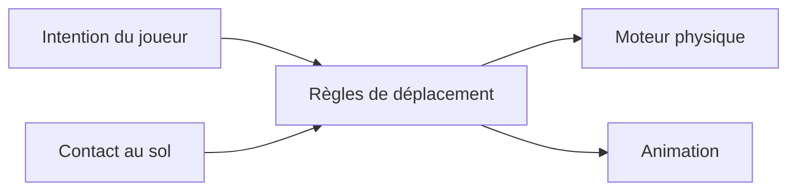
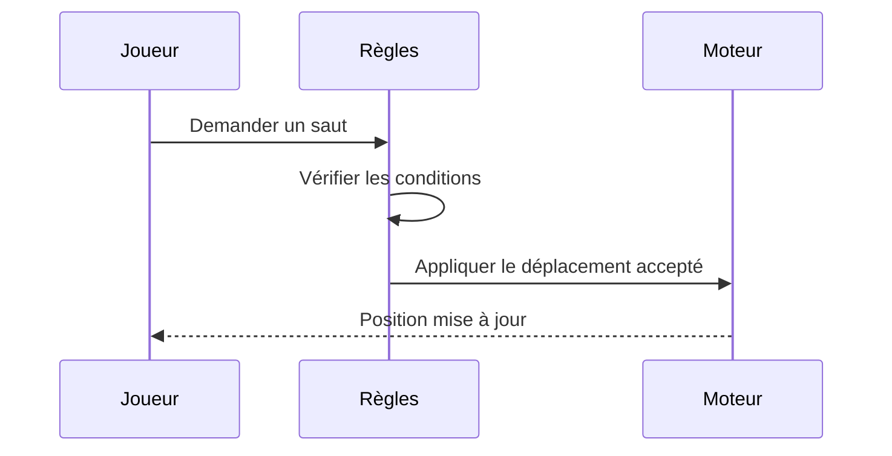

# Contrôleur de personnage

Analyse d’architecture · 22 septembre 2026

**Rapport d’exemple — aucun audit ni travail réalisé sur ton dépôt.**

> **Prochaine étape recommandée**
>
> Séparer les décisions de déplacement des interactions avec le moteur. Commencer par une refactorisation délimitée ; exclure l’escalade et la nage tant que les règles de déplacement ne sont pas vérifiées.

## Vue d’ensemble

Le contrôleur fonctionne, mais modifier une règle de déplacement touche à la gestion des commandes, à la physique et à l’animation. La priorité n’est pas de multiplier les abstractions : c’est de faciliter la modification et la vérification du comportement existant.

| Périmètre de l’analyse | Contenu |
| --- | --- |
| Déplacement du joueur | Marche, saut, pentes, atterrissage |
| Éléments de preuve | Exemple de chaîne d’appels et liste hypothétique de tests |
| Livraison | Une refactorisation préservant le comportement, soumise à validation |
| Hors périmètre | Escalade, nage, synchronisation réseau |

## Suivi des recommandations

| ID | Proposition | Statut | Priorité | Dépendances | Prochaine étape ou preuve de livraison |
| --- | --- | --- | --- | --- | --- |
| [ARCH-01](#arch-01-separer-lintention-de-la-physique) | Séparer intention et physique | À lancer | Haute | — | Attendre ta consigne ; aucun commit ni PR |
| [ARCH-02](#arch-02-confier-letat-au-sol-a-un-seul-systeme) | Unifier l’état au sol | À lancer | Moyenne | ARCH-01 | Dépend d’ARCH-01 et du choix sur la perte de contact |
| [ARCH-03](#arch-03-traiter-le-renommage-separement) | Harmoniser les noms | À lancer | Basse | — | Aucun défaut démontré ; hors du travail retenu |

<details>
<summary>Comprendre les statuts</summary>

- **À lancer** : le travail n’a pas commencé ; tu choisis quand le lancer.
- **En cours** : le travail a commencé, y compris la relecture et les vérifications.
- **Terminé** : les vérifications et la livraison convenue sont achevées, avec leurs preuves.

Les dépendances, blocages et décisions de report restent des notes dans le suivi, pas des statuts supplémentaires. « À lancer » ne signifie pas que toutes les conditions de lancement sont réunies.

</details>

### ARCH-01 · Séparer l’intention de la physique

```agent-action
Exécute uniquement ARCH-01 : séparer les décisions de déplacement des interactions avec le moteur.
```

**Difficulté observée.** Modifier les conditions autorisant le saut nécessite de toucher à `InputReader`, `PlayerMotor` et `AnimationBridge`. La règle ne peut pas être testée sans lancer une scène.

**Modification proposée.** Donner aux règles de déplacement une entrée explicite et un résultat. Conserver les appels de collision et de déplacement propres au moteur dans le composant existant, plutôt que d’introduire une nouvelle couche de services.

```csharp
MovementResult Step(
    MovementState state,
    PlayerIntent intent,
    GroundContact contact,
    float deltaTime);
```

| Aujourd’hui | Proposition |
| --- | --- |
| Les rappels des commandes modifient aussi l’état de déplacement | Les commandes produisent uniquement une intention |
| La physique décide si le joueur peut sauter | Les règles de déplacement décident ; la physique applique le résultat |
| L’animation conserve son propre indicateur de contact au sol | L’animation utilise le résultat de déplacement validé |

**Critères de validation**

- [ ] La marche, le saut et le comportement sur les pentes sont préservés.
- [ ] Maintenir la commande de saut ne provoque pas de saut supplémentaire après l’atterrissage.
- [ ] Une vérification dans la scène confirme la cohérence des collisions et de l’animation.
- [ ] Les changements de contexte nécessaires accompagnent l’implémentation.

### ARCH-02 · Confier l’état au sol à un seul système

Deux indicateurs peuvent diverger pendant une image lorsqu’on quitte une pente. Confirmer quel système est responsable des observations de contact avant de modifier les appelants. Cette proposition dépend de la séparation retenue pour **ARCH-01**.

> **Décision encore nécessaire :** une brève perte de contact au sol doit-elle préserver la possibilité de sauter ? Il s’agit d’un choix de gameplay, pas d’une hypothèse à imposer lors de la refactorisation.

### ARCH-03 · Traiter le renommage séparément

Les différences de nommage ne justifient pas à elles seules une refactorisation. Préserver les noms publics et reporter ce point tant qu’aucune incompréhension concrète ni aucun défaut n’est démontré.

## Prochaines actions

1. Valider le périmètre proposé pour **ARCH-01** avec le responsable.
2. Établir un état initial où les tests passent et le test de non-régression à l’atterrissage.
3. Refactoriser uniquement le périmètre approuvé et les appelants concernés.
4. Faire relire les modifications indépendamment, relancer les vérifications et signaler les limites restantes.

## Preuves et limites

Chaîne d’appels étudiée : `InputReader.cs → PlayerMotor.cs → AnimationBridge.cs`.

La séparation proposée reste à valider dans le moteur. Aucun test exécuté ni gain de performance mesuré.

## Exemples de diagrammes




