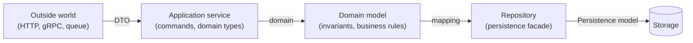

# State & Data

How to manage application state, data flow, the source of truth, and the
persistence boundary. The unifying rule:

> **Any datum that is writable in two places is a bug in waiting.** It's either
> derived (compute it), a cache (invalidate it from the authority), or you must
> elect a single source of truth.

Libraries named below (Redux, TanStack Query, Zustand, EF Core, bitECS…) are
**examples of a principle**, not prescriptions.

---

## 1. Source of truth, primary vs derived, normalization

A well-built app is a **deterministic function of its state**; consumers (UI,
reports) are pure projections. Anything recomputable should not be stored.

| Concept | Definition | Rule |
| --- | --- | --- |
| **Primary state (source of truth)** | The minimal state you *must* store | Store it **once**, in one place |
| **Derived state** | Deterministically computable from primary (totals, sorts, `isComplete`) | **Never store** as a parallel writable field → compute on read |
| **Normalized state** | Flat entities indexed by ID, relations by ID reference | Treat the store like a database |

> *If you can recompute it deterministically, don't store it.* Storing derived
> data creates **drift**: an input changes, the derived copy forgets to refresh,
> and the UI silently lies.

Derive without duplicating via **memoized selectors**, **computed signals**, or
read-only view models. Only precompute into a writable field if profiling proves
the projection is the bottleneck.

---

## 2. Unidirectional flow & state machines

**Flux/Redux** — one-way, predictable, debuggable flow:

```
User → View → (Action/Event) → Store → Reducer (pure) → (State) → View
```

Reducers are state machines: pure `(state, action) → newState`, immutable state,
single observable tree → time-travel debugging, replayable audit log.

**State machine (XState/statecharts)** — a "reducer with rules": explicit legal
**transitions** between finite states, making illegal states unrepresentable.

| Tool | Sweet spot | Avoid for |
| --- | --- | --- |
| Redux/RTK | Large apps, shared state, audit/replay required | Simple CRUD, mostly-remote data |
| State machine (XState) | The feature is a **protocol** (payment, onboarding, wizard) | Login forms, simple filters |
| Query cache | Any data crossing the network | — |

> Choose a state machine when the feature is a *protocol*, not a bag of flags.

---

## 3. Server state vs client state vs UI state

*Application state is not one thing.* Conflating server and client state — by
copying fetched data into a global store — is the **#1 state-management mistake**.

| Property | Server state | Client state |
| --- | --- | --- |
| Owner | A remote system you don't control | This client session |
| Lifecycle | Can go stale, change behind your back | Changes only when user/app does |
| Sync | Async, can fail/be slow | Sync, always available |
| Examples | User profile, product list, search results | Open modal, active tab, theme, form draft |
| Needs | Cache, dedup, refetch, invalidation | Read/write, sometimes shared |

**Where to put a piece of state:**

```
1. Server data?        → query/cache layer (key = request identity).
                          Mutate then invalidate keys. Do NOT mirror it elsewhere.
2. One component?       → local component state.
3. A few neighbors?     → lift to nearest common ancestor.
4. Many distant ones?   → a small client store scoped to that concern.
5. Rare app-wide config → context.
```

**Major anti-pattern:** fetch in an effect → write to a global store → manually
refetch on focus/interval = reimplementing a query cache, worse. The framework-
agnostic lesson is *"use a query cache"* (TanStack Query, SWR, RTK Query fill the
same role), not *"use this package"*. URL = shareable state (filters, pagination,
view mode → query params).

---

## 4. The persistence boundary: Repository, Unit of Work, DTO vs entity

Separate three models — conflating them is what makes code rigid:



| Model | Role | Knows |
| --- | --- | --- |
| **Domain model** | Business rules + invariants | Nothing about DB or transport |
| **Persistence model** (entity/DAO) | Mirrors the schema, ORM relations | The storage schema |
| **DTO** | External contract, shaped for the consumer | No domain behavior, no persistence logic |

> DTOs are not your domain model, and not your ORM entities — they're the shape
> you promise the outside world, so domain and persistence can evolve without
> breaking the contract.

- **Repository** = collection-like facade over domain aggregates; interface
  defined in the domain, implementation in infra (the ORM never leaks into the
  domain).
- **Unit of Work** = one transaction spanning N inserts/updates/deletes →
  all-commit-or-all-rollback, coordinating repositories around a single commit
  point. (EF Core's `DbContext` is both Repository and UoW; `SaveChanges()` =
  commit.)

**Pragmatic nuance:** a full separate persistence model is costly; often the ORM
already does the job. Separate when the domain is large/complex/concurrent.

---

## 5. CQRS & Event Sourcing — when, and when it's overkill

Two **orthogonal** patterns, among the most misapplied. Start simple and escalate:

```
CRUD, similar reads/writes        → 3-tier + Postgres
Reads/writes differ in shape       → CQRS WITHOUT event sourcing
  (no audit need)                    (Postgres writes + materialized views / read replica)
Audit / temporal / replay critical → CQRS + Event Sourcing (surgical, per aggregate)
```

> Start with CQRS without Event Sourcing: Postgres for writes, materialized
> views/read replica for reads. 80% of the benefit, 20% of the complexity.

**Event Sourcing is justified if ≥2 are truly true:** provable audit/history
(finance, regulated); multiple concurrent writers on one aggregate; temporal
queries ("state last Tuesday"); replay with corrected rules; several independent
read models. Decisive test: *is the domain genuinely event-shaped, or am I
retrofitting an event metaphor onto a CRUD problem?*

**Permanent cost of ES** (before any benefit): two eventually-consistent models;
**every event is part of the public contract forever** (no `ALTER COLUMN` —
version and keep old readers); debugging = replaying history. For most B2B SaaS,
**Postgres + an audit table + CDC** is the better trade. Never event-source the
whole system — only the aggregates that earn it.

---

## 6. Optimistic updates, cache invalidation, local-first

**Optimistic update** — update the UI before server confirmation, roll back on
failure (snapshot → apply → rollback → settle):

```ts
await cache.cancelQueries(key)
const previous = cache.get(key)                  // snapshot for rollback
cache.set(key, optimisticallyUpdate(previous))   // instant UI
// onError: cache.set(key, previous)             // rollback
// onSettled: cache.invalidate(key)              // refetch = reconciliation
```

**Cache invalidation** — *stale-while-revalidate*: serve the cached copy
immediately, then refetch in the background. Invalidation scope must match the
mutation (affected keys/entities).

**Local-first** — invert the model: the **local store (SQLite/IndexedDB) is the
primary source of truth, not a cache**. Reads are instant; writes commit locally
first; sync in background; the server becomes replication, not authority. Conflict
resolution by need:

| Strategy | Use | Cost |
| --- | --- | --- |
| **LWW / field-level** | ~95% of CRUD; simple scalars | Can lose data |
| **CRDT** (Yjs, Automerge) | Rich text, concurrent list ordering | Complex; log growth → compaction |
| **OT** | Real-time collaborative editing, always-connected | Needs a central server |

Checklist: **persistent queue** (mutations survive restart); **server-side
semantic validation** at write-back (a structurally valid merge can be
business-invalid, e.g. double-booking); **explicit per-field conflict policy**;
plan for storage eviction; version migrations applied lazily client-side.

---

## 7. Per-domain declensions

- **Game** — The ECS **world** is the runtime source of truth; components are
  packed data, derived state (spatial grids, indices) rebuilds per frame. Save =
  snapshot serializer over component arrays + ID remapping; distinguish full
  **snapshot** (save game) from **delta** (bandwidth). **Always remap entity IDs
  on load** (ID spaces differ across client/server/save). See
  [game/architecture-principles.md](./game/architecture-principles.md).
- **Desktop (Tauri/Electron)** — The **Rust backend owns the source of truth**
  (managed state behind `Mutex`/`RwLock`), exposed via commands; Webviews pull
  snapshots or receive events, never duplicate truth. Preferences/theme/window
  geometry → a small JSON store; multi-row data → SQLite; **secrets → OS
  keychain** (the JSON store is not encrypted).
- **Web/SPA + API** — Direct application of §3: server is authority; the query
  cache holds the remote snapshot; a small client store holds true UI state. On
  SSR, hydrate the initial fetch into the query cache; keep the client store out
  of the data path.
- **Service/backend** — The DB is authority; caches (Redis, materialized views,
  read replicas) are **derived projections** to invalidate, never a second write
  authority. Repository isolates access, Unit of Work guarantees write atomicity;
  CQRS *without* ES first; audit via audit table + CDC.

---

## 8. Traps

| Trap | Symptom | Fix |
| --- | --- | --- |
| **Duplicated / desynced state** | Same datum in the query cache *and* a global store | One source per datum; don't mirror server state |
| **Stored derived state** | A writable `cartTotal` recomputed by hand; update leaks | Compute on read (selectors/computed/signals) |
| **God global store** | One "app state" mixing user list (server) + `isSidebarOpen` (client) | Bucket by kind, scope, keep true global small |
| **Homegrown refetch in an effect** | effect fetch → global store → refetch on focus | Use a query cache |
| **Entities exposed as the API contract** | DB schema change breaks the API | DTO at the boundary; map Domain↔Persistence↔DTO |
| **ORM/DbContext everywhere** | "you don't have a domain" | Repository as a facade |
| **Speculative CQRS/ES** | Adopted "just in case" | Start CRUD/Postgres; event-source only event-shaped aggregates |
| **Unremapped IDs on load** (game) | Entity collisions across save/network | Regenerate and map old→new on deserialization |

### Sources
- State management guides: https://feature-sliced.design/blog/frontend-state-management-guide · https://sujeet.pro/articles/state-management-patterns · https://redux.js.org/usage/structuring-reducers/normalizing-state-shape
- Server vs client state: https://tanstack.com/query/latest/docs/framework/react/overview · https://nextfuture.io.vn/blog/react-server-state-vs-client-state-guide
- Persistence/Repository/DTO: https://learn.microsoft.com/en-us/dotnet/architecture/microservices/microservice-ddd-cqrs-patterns/infrastructure-persistence-layer-design · https://enterprisecraftsmanship.com/posts/having-the-domain-model-separate-from-the-persistence-model/
- CQRS/ES: https://www.techplained.com/cqrs-event-sourcing · https://artium.ai/insights/event-sourcing-when-is-it-right-to-use
- Local-first: https://sujeet.pro/articles/offline-first-architecture · https://dev.to/smallstack/crdts-and-local-first-architecture-how-smallstack-handles-offline-conflict-resolution-338c
- Game/ECS: https://bitecs.dev/docs/serialization · https://github.com/SanderMertens/ecs-faq
- Desktop/Tauri: https://v2.tauri.app/develop/state-management/ · https://github.com/tauri-apps/tauri-plugin-store
