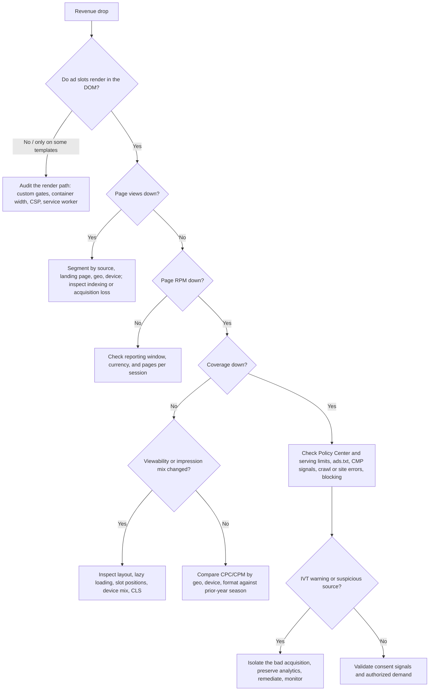

# Diagnosing a revenue drop

Separate traffic from monetization before touching anything. A fall caused by lost search traffic is upstream of AdSense, and no placement change addresses it.

**Check that slots render at all before anything else.** A slot suppressed in code produces no request, no impression, and no error — only a coverage figure nobody segmented. It is invisible to every metric in the account, so it never surfaces from reporting alone. Load the affected templates and confirm an `<ins class="adsbygoogle">` reaches the DOM; if it does not, the cause is in the render path and the rest of this tree is noise. See the render-path audit in [frameworks.md](./frameworks.md).

## Ordered checklist

1. **Confirm slots render.** Load each monetized template — including at mobile widths — and check for `<ins class="adsbygoogle">` in the DOM with a non-zero width. A template producing zero ad requests is usually a code problem; once the render path is ruled out, check whether policy action or consent suppresses that inventory. ([Render-path audit](./frameworks.md))
2. **Normalize the comparison.** Compare equal weekdays and year-over-year periods, and identify Q4/Q1 or event-driven demand shifts before calling anything a regression. ([Reporting](https://support.google.com/adsense/answer/6155974))
3. **Separate traffic from monetization.** Pull page views, sessions, pages per session, geography, device, source, and top landing pages. ([Glossary](https://support.google.com/adsense/answer/6084409))
4. **Check account surfaces.** Policy Center, payment holds, invalid-traffic adjustments, and any "ad serving limit placed on your account" message. ([Serving limits](https://support.google.com/adsense/answer/9437976))
5. **Validate `ads.txt`.** Fetch `/ads.txt` with no redirect or auth error, verify the exact publisher ID and `DIRECT` relationship, then allow crawl propagation before judging the fix. ([Crawl timing](https://support.google.com/adsense/answer/7679060?hl=en))
6. **Inspect coverage.** Segment by site, ad unit, country, platform, and date. A coverage collapse points at demand eligibility, consent, policy, or implementation — not placement. ([Coverage](https://support.google.com/adsense/answer/92360?hl=en))
7. **Test consent by region.** Confirm the certified CMP appears across all EEA/UK/Swiss regions, stores and passes valid signals, and does not accidentally suppress all ad requests. ([Certified CMP](https://support.google.com/adsense/answer/13554020?hl=en-GB))
8. **Review blocking changes.** Broad category, URL, advertiser, or network blocks reduce eligible **demand**. ([Blocking](https://support.google.com/adsense/answer/180609))
9. **Look for layout regressions.** Moved slots, hidden containers, zero-width responsive parents, late rendering, new overlays, sticky or navigation conflicts. ([Responsive behavior](https://support.google.com/adsense/answer/9183460))
10. **Check viewability and loading.** Compare Active View and impression counts: a new lazy-load threshold reduces requests, while a new eager load inflates unseen impressions. ([Active View](https://support.google.com/adsense/answer/3481946?hl=en))
11. **Audit traffic quality.** Sudden CTR, geography, referrer, user-agent, engagement, or paid-campaign changes can trigger filtering or limits. ([Traffic quality](https://support.google.com/adsense/answer/1112983))
12. **Estimate ad blocking separately.** Client-side blockers cut requests before AdSense reports them. Measure with privacy-respecting first-party methods, keep the measurement out of the render path, and prefer a self-built, dismissible recovery notice over Google Ad Blocking Recovery, whose interstitial you do not control — see [frameworks.md](./frameworks.md). ([IAB detection guidance](https://iabtechlab.com/standards/ad-block-detection/))

## Diagnose before adding inventory

Identify which of traffic, fill, auction value, or measurement actually moved, and fix that. Extra slots added in response to a drop mask the real cause while worsening UX and raising policy risk — so new inventory is a conclusion this checklist earns, not an opening move. ([Placement best practices](https://support.google.com/adsense/answer/1282097?hl=en))

## Mapping symptom to cause

| Symptom | Most likely causes |
| --- | --- |
| Ads never appear on a template, or only above a breakpoint | Usually the render path: a custom gate, a container with no width, a slot hidden at that breakpoint, CSP, or a service worker. Rule the code out first, then check whether policy action or consent suppresses that inventory specifically. |
| Ads disappeared after an unrelated deploy | CSP tightened, `public/` asset renamed or removed, service-worker caching added, or a component refactor that changed slot identity. |
| Console: `All 'ins' elements already have ads in them` | A duplicate `push({})` — see [frameworks.md](./frameworks.md). Revenue may be intact, but the error often accompanies slots that never fill after navigation. |
| Revenue down, page views down, RPM flat | Upstream traffic or indexing loss. |
| Revenue down, page views flat, coverage down | `ads.txt`, consent/CMP, policy restriction, serving limit, over-blocking. |
| Revenue down, coverage flat, viewability down | Layout regression, lazy-load threshold, device mix shift. |
| Revenue down, all inventory metrics flat | Auction value: seasonality, geo mix, vertical demand, format mix. |
| Impressions up, RPM down, revenue flat | Added low-**viewable** inventory diluting impression quality. |
| CTR spiked, then revenue fell | Accidental clicks or invalid traffic, followed by filtering or a limit. |
| Ads vanished entirely on some pages | Zero-width container, policy action on that inventory, or consent suppressing requests. |
