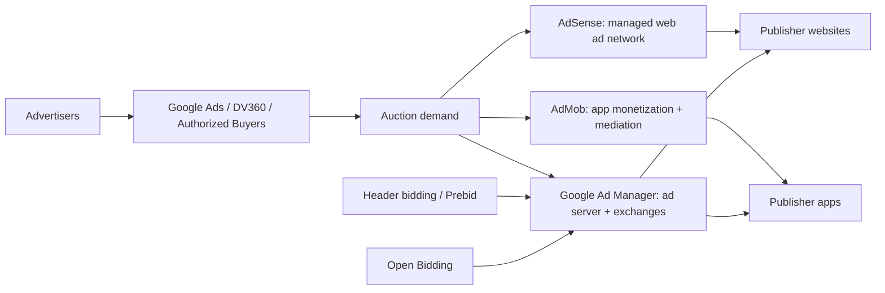

# Ecosystem and platform choice

Answer "should I move off AdSense?" from operational need, never from a promised RPM multiple.

## The products

| Layer | Precise role | Appropriate publisher | Source |
| --- | --- | --- | --- |
| **AdSense** | A web ad network: Google supplies demand and automates inventory setup and optimization. | Website publishers wanting fast implementation, automation, and accessible reporting, often with a small ad-ops team. | [Product comparison](https://support.google.com/adsense/answer/9234653?hl=en) |
| **Google Ad Manager** | An ad server and management platform combining direct deals, AdSense, Ad Exchange, and third-party networks and exchanges. | Operationally mature publishers with direct sales, multiple demand sources, or granular trafficking and reporting needs. | [Product comparison](https://support.google.com/adsense/answer/9234653?hl=en) |
| **AdMob** | Mobile-app ad network and monetization platform including mediation and bidding. Not the product for web pages. | App developers. | [Product comparison](https://support.google.com/adsense/answer/9234653?hl=en) |
| **Ad Exchange / AdX** | Google folded the former Ad Exchange brand into Ad Manager; "AdX" persists as ad-ops shorthand for exchange demand. | Publishers operating through GAM, directly or via a managed partner. | [Ad Manager launch](https://blog.google/products/admanager/introducing-google-ad-manager/) |
| **Header bidding / Prebid** | A client- or server-side auction letting multiple SSPs bid before or alongside the ad-server decision. An orchestration layer, not an AdSense feature. | Publishers with GAM and ad-ops capability, at enough scale to absorb latency, contracts, reconciliation, and compliance overhead. | [Prebid](https://docs.prebid.org/overview/intro.html) |
| **Open Bidding** | Ad Manager's server-side bidding mechanism — a GAM demand integration, not an AdSense control. | GAM publishers approved for participating exchanges and yield groups. | [Open Bidding](https://support.google.com/admanager/answer/7128453) |

**"AdX always has better advertisers" is too broad.** Google states all three publisher products can serve high-quality ads and access the same premium Authorized Buyers. The defensible differences are operational: direct sales, multi-network competition, controls, and reporting depth. ([Product comparison](https://support.google.com/adsense/answer/9234653?hl=en))

## When a publisher has outgrown AdSense

Functionally, when it needs direct-sold campaign trafficking, multiple exchanges and networks competing inside one ad server, complex reporting, or app, video, and game inventory in one system — Google's own stated GAM use cases. ([Product comparison](https://support.google.com/adsense/answer/9234653?hl=en))

Not because someone was promised a higher RPM.

## Managed networks

Entry criteria change frequently, so check the live first-party page at decision time rather than repeating a remembered threshold. Historic "100k pageviews" and "25k sessions" figures circulate widely as folklore and should not be stated as current requirements.

| Provider | Where to verify | Note |
| --- | --- | --- |
| Mediavine | [Approval requirements](https://help.mediavine.com/what-does-it-take-to-get-approved-by-mediavine) | Qualification is revenue- and quality-based, not purely traffic volume. |
| Journey by Mediavine | [Same page](https://help.mediavine.com/what-does-it-take-to-get-approved-by-mediavine) | An on-ramp for smaller sites; acceptance still includes quality and policy review. |
| Raptive | [Creators](https://raptive.com/creators/) | Requirements are program- and region-dependent. |
| Ezoic | [Eligibility](https://www.ezoic.com/eligibility-requirements/) | Access and requirements vary by program. |

**No managed network guarantees higher RPM.** Advantages can come from demand competition, video and native products, optimization, and ad-ops service — offset by revenue share, contracts, site-speed effects, and reduced control. This is genuinely **contested** territory.

Compare on net revenue, session RPM, Core Web Vitals, UX, contract and exit terms, and support quality. Run the comparison; promise no multiple.
