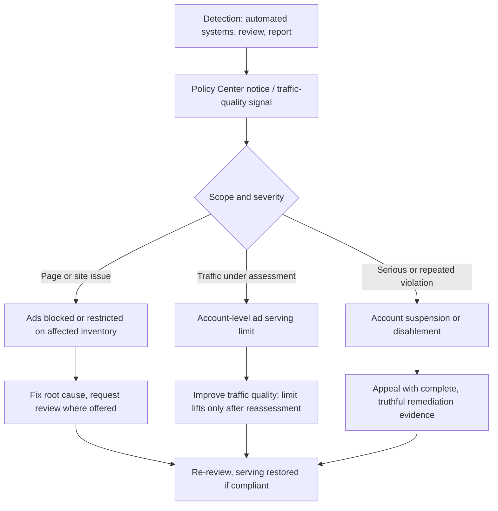

# Policy gate

Every gate below is checked before revenue work. A failure outranks the entire optimization backlog: restricted or disabled inventory earns nothing that a better placement can recover.

Policy wording evolves. For an edge case, read the live page linked in the row rather than relying on the summary here.

## The gates

| Gate | Pass condition | Source |
| --- | --- | --- |
| Content eligibility | Every monetized screen carries substantive original publisher content. | [Publisher Policies](https://support.google.com/publisherpolicies/answer/10502938?hl=en) |
| Content dominance | Publisher content outweighs ads and paid promotional material on every screen. | [Publisher Policies](https://support.google.com/publisherpolicies/answer/10502938?hl=en) |
| Placement safety | No ad sits where it can be mistaken for content or catch an accidental tap. | [Ad placement policies](https://support.google.com/adsense/answer/1346295?hl=en) |
| Click integrity | No solicitation, incentive, or self-clicking anywhere in the property or its promotion. | [Encouraging clicks](https://support.google.com/adsense/answer/48182) |
| Traffic validity | Traffic comes from legitimate acquisition, with no exchanges, bots, or paid-to-click sources. | [Invalid traffic](https://support.google.com/adsense/answer/16737) |
| Privacy disclosure | The privacy policy discloses third-party cookies, web beacons, and IP use for ad serving. | [Publisher Policies](https://support.google.com/publisherpolicies/answer/10502938?hl=en) |
| Consent (EEA/UK/CH) | A Google-certified CMP is live and passing valid signals. | [Certified CMP](https://support.google.com/adsense/answer/13554020?hl=en-GB) |
| Children | Child-directed requests carry the child-directed treatment signal. | [Child-directed treatment](https://support.google.com/adsense/answer/3248194) |
| `ads.txt` | The exact publisher line is served at the root domain and is crawlable. | [ads.txt guide](https://support.google.com/adsense/answer/12171612?hl=en-EN) |
| Code integrity | Only Google-permitted modifications to the generated code. | [Ad code modifications](https://support.google.com/adsense/answer/1354736) |
| Render path | Every condition between a mount and the `<ins>` passes the **fail-open** audit. | [Render-path audit](./frameworks.md) |
| Account surfaces | Policy Center clear, no ad serving limit, no payment hold. | [Policy Center](https://support.google.com/adsense/answer/9485926?hl=en) |

Mark each gate pass, fail, or unverifiable-without-account-access. Gates needing account access (Policy Center, serving limits, payment holds, coverage) cannot be cleared from page source alone — name them as user actions.

## Eligibility and approval

| Requirement | Operational meaning | Source |
| --- | --- | --- |
| Original, valuable content | Ads are disallowed on screens with no publisher content, low-value content, under construction, used for alerts/navigation, or replicating content without added commentary, curation, or value. | [Publisher Policies](https://support.google.com/publisherpolicies/answer/10502938?hl=en) |
| Publisher control | The applicant can place code and demonstrate ownership of the submitted site. | [Site eligibility](https://support.google.com/adsense/answer/7584263) |
| Age | Participants are 18+; a parent or guardian may sign up with their own Google Account for an under-18 publisher. | [Age requirement](https://support.google.com/adsense/answer/14230) |
| Language | Content is primarily in an AdSense-supported language. | [Supported languages](https://support.google.com/adsense/answer/9727) |
| Navigation | Reviewers reach real pages; broken links, login walls, and empty categories make a site read as unavailable or low value. | [Site review](https://support.google.com/adsense/answer/10015918) |
| Availability | The URL resolves publicly, is crawlable, and is not blocked by robots or authentication. | [Site unavailable](https://support.google.com/adsense/answer/12176698) |

**Fixing "low value content" and "insufficient content".** These are structural verdicts on inventory value, so treat them structurally: publish substantive original pages, merge or remove thin and templated pages, make authorship and site purpose legible, ensure privacy/contact/about pages exist, and repair navigation. Padding word count establishes nothing.

## Setup and `ads.txt`

1. Add the site in AdSense and connect it with the code snippet, an `ads.txt` entry, or the mechanism the account offers. ([Site setup](https://support.google.com/adsense/answer/7584263))
2. Keep the site public and crawlable throughout review. ([Availability](https://support.google.com/adsense/answer/12176698))
3. Publish `ads.txt` at the root domain with the exact line, substituting the real publisher ID:

   ```text
   google.com, pub-0000000000000000, DIRECT, f08c47fec0942fa0
   ```

   ([ads.txt guide](https://support.google.com/adsense/answer/12171612?hl=en-EN))
4. Google calls `ads.txt` highly recommended rather than universally mandatory — but once a domain publishes one, serving where the relevant seller is not listed as authorized violates policy. ([Publisher Policies](https://support.google.com/publisherpolicies/answer/10502938?hl=en))
5. Buyers may bid only on authorized inventory, so a missing, stale, malformed, or uncrawlable entry silently removes **demand**. ([Troubleshooter](https://support.google.com/adsense/troubleshooter/9556696?hl=en))
6. Changes take several days to appear, and up to a month on low-request sites — do not judge a fix immediately. ([Crawl timing](https://support.google.com/adsense/answer/7679060?hl=en))
7. `ads.txt` is an IAB Tech Lab mechanism for declaring authorized sellers and reducing counterfeit inventory. ([IAB Tech Lab](https://iabtechlab.com/ads-txt/))

## Prohibited content

Google Publisher Policies prohibit or condition monetization across these areas. All rows cite [Publisher Policies](https://support.google.com/publisherpolicies/answer/10502938?hl=en) unless noted.

| Area | What is disallowed |
| --- | --- |
| Illegal content | Illegal content, promotion of illegal activity, infringement of legal rights. |
| Intellectual property abuse | Copyright infringement; sale or promotion of counterfeit goods. |
| Dangerous or derogatory | Inciting hatred or discrimination, harassment, threats, promoting self-harm, supporting terrorist or criminal organizations. |
| Animal cruelty | Promoting cruelty or gratuitous violence toward animals. |
| Misrepresentation | Deceptive identity, purpose, or affiliation; demonstrably false claims that undermine trust. |
| Dishonest behavior | Helping users mislead others, cheat, or gain unauthorized access. |
| Sexually explicit content | Explicit sexual content is prohibited; some non-explicit themes fall under [Restrictions](https://support.google.com/publisherpolicies/answer/10437795) instead. |
| Shocking content | Graphic, gruesome, or disgusting material — prohibited or restricted by context. ([Restrictions](https://support.google.com/publisherpolicies/answer/10437795)) |
| Malware / unwanted software | Screens containing malware or violating the Unwanted Software policy. |
| Search spam / abusive experiences | Screens violating Search spam policies or containing abusive experiences; Better Ads Standards apply. |

**Restricted is not prohibited.** Restricted content — some sexual and shocking content, explosives, guns, tobacco, recreational drugs, alcohol, gambling, prescription drugs — may receive fewer ads or none, because only limited **demand** is eligible. Product, country, and age rules still apply. A publisher seeing low coverage on such content is seeing a restriction, not a bug. ([Publisher Restrictions](https://support.google.com/publisherpolicies/answer/10437795))

## Invalid traffic

- Verify rendering by inspecting the page; leave live ads unclicked. ([IVT](https://support.google.com/adsense/answer/16737))
- Keep solicitation out: no click requests, rewards, compensation for viewing, or language and imagery drawing unnatural attention to ads. ([Encouraging clicks](https://support.google.com/adsense/answer/48182))
- Keep bots, automated clicking or impression tools, paid-to-click, autosurf, click exchanges, and deceptive sources away from the property. ([IVT](https://support.google.com/adsense/answer/16737))
- Publishers own their traffic even when a third party generated it. Monitor referrers, geographies, devices, CTR anomalies, and sudden low-engagement bursts. ([Traffic quality](https://support.google.com/adsense/answer/1112983))
- Invalid activity may be filtered live, deducted at finalization, trigger a serving limit, or close the account. Impression fraud counts even with no clicks. ([IVT](https://support.google.com/adsense/answer/16737))

**GIVT vs SIVT** are MRC audit categories — General Invalid Traffic detectable by routine filtering, Sophisticated Invalid Traffic needing advanced analytics — not two AdSense account states. ([MRC IVT Addendum](https://www.mediaratingcouncil.org/sites/default/files/Standards/IVT%20Addendum%20Final.pdf))

## Privacy, consent, and children

| Regime | Obligation | Source |
| --- | --- | --- |
| Privacy disclosure | Disclose that third parties may set or read cookies and use web beacons or IP addresses for ad serving. | [Publisher Policies](https://support.google.com/publisherpolicies/answer/10502938?hl=en) |
| EEA / UK / Switzerland | Disclose data use and obtain consent for cookies and local storage where legally required, and for collecting, sharing, and using personal data for ad personalization. | [EU user consent policy](https://www.google.com/about/company/user-consent-policy/) |
| Certified CMP | Serving personalized ads in the EEA, UK, or Switzerland requires a Google-certified CMP integrated with the IAB TCF; without one, personalized ads are ineligible. | [Certified CMP](https://support.google.com/adsense/answer/13554020?hl=en-GB) |
| TCF version | Check the live European-message page for the supported TCF version rather than hard-coding one; it changes. | [European regulations](https://support.google.com/adsense/answer/10961068?hl=en-GB) |
| No consent | Configure non-personalized or limited ads per Google's signals and the legal basis. Consent is never inferred from silence or inactivity. | [Ad serving without consent](https://support.google.com/adsense/answer/7670312) |
| US state privacy | Privacy & messaging can show US-state regulation messages and apply restricted data processing; legal compliance stays with the publisher. | [US state messages](https://support.google.com/adsense/answer/10886910) |
| COPPA | Set the child-directed treatment signal for child-directed requests; Google then disables interest-based advertising and remarketing for them. | [Child-directed treatment](https://support.google.com/adsense/answer/3248194) |

Two boundaries worth stating to a user explicitly:

- Google certification assesses a CMP against Google's criteria — not full TCF or privacy-law compliance. The publisher still needs its own legal analysis. ([Certified CMP](https://support.google.com/adsense/answer/13554020?hl=en-GB))
- The child-directed tag is a technical signal, not a substitute for COPPA analysis, parental consent, or age-appropriate product design. ([Child-directed treatment](https://support.google.com/adsense/answer/3248194))

## Code and placement compliance

- Make only the modifications Google's guidance permits; changes must not artificially inflate performance, harm advertisers, or bypass product behavior. ([Modifications](https://support.google.com/adsense/answer/1354736))
- Leave the ad iframe, creative, and disclosure labels intact; no forced clicks, no targeting manipulation. ([Modifications](https://support.google.com/adsense/answer/1354736))
- Keep ads off screens with no or low-value content, under construction, or serving mainly alerts and navigation. ([Publisher Policies](https://support.google.com/publisherpolicies/answer/10502938?hl=en))
- Ads are prohibited inside email and where private communication is the primary focus, and must not run out of context or in the background. ([Placement policies](https://support.google.com/adsense/answer/1346295?hl=en))
- Embedding in software or an app requires the appropriate Google publisher product; ordinary AdSense web code is not a desktop software ad SDK. ([Policies](https://support.google.com/adsense/answer/48182))

## Enforcement ladder



**An ad serving limit is not a ban with a known end date.** Google may limit ad volume while assessing traffic quality or invalid-traffic concerns. The response is to keep producing valid traffic and repair acquisition and implementation problems — rotating accounts or swapping code compounds the problem. ([Serving limits](https://support.google.com/adsense/answer/9437976))

Policy Center names affected inventory, impact, and required actions, often with screenshots, and some issues allow a review request after remediation. Disabled-account appeals require accurate evidence and are not guaranteed. ([Policy Center](https://support.google.com/adsense/answer/9485926?hl=en), [appeals](https://support.google.com/adsense/answer/2576043?hl=en))

## Payments

| Item | Behavior | Source |
| --- | --- | --- |
| Tax information | May be required by location; missing information can hold payment. | [Tax info](https://support.google.com/adsense/answer/1714364) |
| Identity / address | At the local verification threshold Google may require identity verification and mail a six-digit PIN. | [PIN](https://support.google.com/adsense/answer/157667?hl=en) |
| PIN deadline | Address verification completes within four months of PIN generation or ads stop serving; three incorrect entries also stop serving. | [PIN](https://support.google.com/adsense/answer/157667?hl=en) |
| Threshold | The default USD threshold is `$100`; thresholds vary by reporting currency and can be raised but not lowered. | [Thresholds](https://support.google.com/adsense/answer/1709871) |
| Cycle | Earnings finalize after month-end; if the balance meets threshold by the 20th with no holds, payment issues between the 21st and 26th. | [Timeline](https://support.google.com/adsense/answer/7164703?hl=en) |
| Adjustments | Google may deduct invalid-activity earnings, withhold during investigation, or refund advertisers. | [Timeline](https://support.google.com/adsense/answer/7164703?hl=en) |
