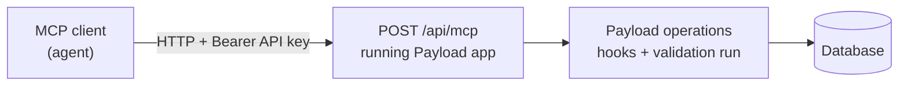

# The MCP plugin

Reference for `@payloadcms/plugin-mcp`, Payload's official Model Context
Protocol server. Read this before hand-writing scripts to read or mutate
documents in a project that already has it configured.

## What it actually is

A **server-side Payload plugin** that turns the running app into an MCP server
at `POST /api/mcp`. It is a runtime channel into the project's *data* — not a
source of knowledge about Payload, and not a way to edit config.



The split that decides your approach:

| Task | Channel |
| --- | --- |
| Read, create, update, delete documents in a running app | MCP tools |
| Inspect the live schema and collection slugs | MCP `getConfigInfo` / `getCollectionSchema` |
| Add a collection, field, hook, or access rule | Edit `payload.config.ts` — MCP cannot |
| Anything with the app not running | File editing |

## Setup

```ts
import { mcpPlugin } from '@payloadcms/plugin-mcp'

export default buildConfig({
  plugins: [mcpPlugin({ collections: { posts: { enabled: true } } })],
})
```

`enabled` takes a boolean or a per-operation object (`find`, `create`, `update`,
`delete`; globals support `find` and `update` only). The plugin adds an API-key
collection to the config, and stdio-based MCP clients bridge to the HTTP
endpoint through the `mcp-remote` package.

Version it in lockstep with `payload` — every `@payloadcms/*` package shares the
core version number.

## Three gates, not one

Enabling a collection in the plugin config does **not** make it reachable. Every
call passes three independent checks:

1. **Plugin config** — the collection and operation are enabled in
   `payload.config.ts`.
2. **API key record** — the per-capability toggles on that key in the Admin
   Panel, editable at runtime.
3. **Payload access control** — the request runs as the user attached to the API
   key, so collection access rules, field access and hooks all apply.

That third gate is the one to state out loud: **MCP is not privileged**. Unlike
the Local API, it does not bypass access control, and its writes go through
validation and hooks. It is not an escape hatch around a rule you find
inconvenient.

A refusal from MCP is usually gate 2 or 3, not a bug: check the key's toggles
and the collection's access rules before rewriting the call.

## The tools are generic

Tools are **not** named per collection. They are shared tools that take a
`collectionSlug` or `globalSlug` argument:

- Documents: `findDocuments`, `findDistinct`, `countDocuments`,
  `createDocuments`, `updateDocument`, `deleteDocuments`, `duplicateDocument`.
- Schema discovery: `getConfigInfo`, `getCollectionSchema`, `getGlobalSchema`.
- Versions (collections with versions enabled): `findVersions`,
  `findVersionByID`, `countVersions`, `restoreVersion`.
- Globals: `findGlobal`, `updateGlobal`, plus the global version tools.
- Auth collections: `login`, `auth`, `forgotPassword`, `resetPassword`,
  `unlock`, `verify`.
- Uploads: `getUploadInstructions`.

Start with `getConfigInfo` to discover the real slugs, then
`getCollectionSchema` before writing — the live schema beats any assumption
drawn from reading files.

## Config escape hatches

| Option | Use |
| --- | --- |
| `disabled: true` | Turn the plugin off while keeping the database schema consistent — prefer it to deleting the plugin from a shared database. |
| `overrideAuth` | Replace the Bearer/API-key strategy with a custom one. |
| `overrideApiKeyCollection` | Reshape the generated keys collection. |
| `userCollection` | Which auth collection keys belong to (defaults to `admin.user`). |
| `mcp.tools` / `mcp.prompts` / `mcp.resources` | Custom tools (Zod `parameters` + `handler`), prompts, and resources. |
| `mcp.handlerOptions.maxDuration` | Request ceiling, 60 seconds by default. |
| `onEvent` | Audit logging of MCP activity. |
| `collections[slug].overrideResponse` | Reshape a tool's response. |

Expose a custom `mcp.tools` entry rather than widening `delete` access when an
agent needs one specific compound operation: the tool carries its own
validation, where a broad capability does not.
