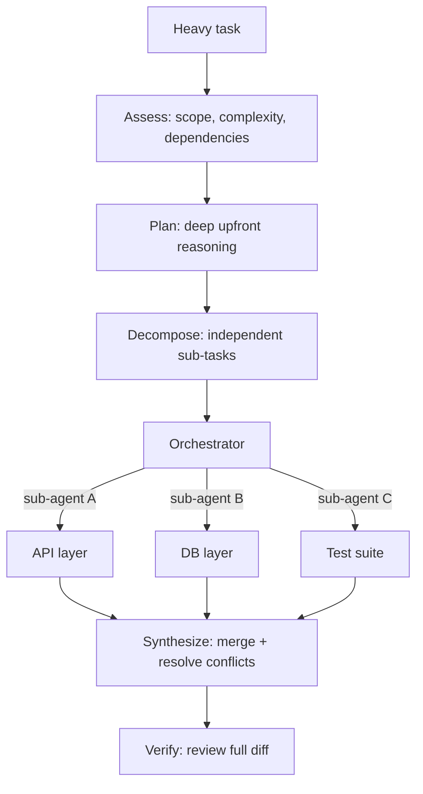

# Workflow (UltraCode-style orchestration)

Use this skill when a task is too large, too complex, or too interconnected for
a single-pass approach. It pushes two capabilities to their maximum and combines
them: extended upfront reasoning and dynamic orchestration of parallel
sub-agents.

The mental model: if a task is the kind of thing a senior engineer would spend
an hour planning before touching code, this workflow is the right tool. For
small or well-defined tasks, skip it — it costs more time and compute. See
[when-to-use.md](./when-to-use.md) for the full decision criteria.

## Core principle: two inseparable halves

1. **Extended reasoning** — think through the full scope before acting. Consider
   multiple approaches, identify edge cases, reason about cross-cutting effects,
   and plan a sequence that avoids dead ends. Front-load the analysis so the
   execution rarely backtracks.
2. **Dynamic orchestration** — act as an orchestrator that decides *when* to
   split the task into independent sub-tasks, dispatches each to a separate
   sub-agent running in parallel, then synthesizes their outputs into a coherent
   whole. Sub-agents are available across modern agent platforms; use whichever
   sub-agent / Task mechanism your environment provides.

Reasoning alone gives you careful but sequential work. Orchestration alone risks
the "too many cooks" problem. The value comes from doing both.

## Phases

Run these phases in order. Do not start dispatching sub-agents before the plan
is solid.



1. **Assess** — Measure scope. How many files/modules? Which parts are tightly
   coupled vs. easily swappable? What could break? If the task is small or
   linear, stop here and handle it normally.
2. **Plan (deep reasoning)** — Produce a sequenced plan that flags potential
   breaking changes before any file is touched. Separate the thinking from the
   doing so issues are caught before they are baked into code.
3. **Decompose** — Split the work into sub-tasks that are *independent* enough to
   run concurrently (e.g. API layer, DB layer, test suite). Context-aware
   splitting, not a rigid template.
4. **Dispatch** — Launch one sub-agent per independent sub-task, in parallel.
   Give each a clear, self-contained scope and the context it needs.
5. **Synthesize** — As the orchestrator, review every sub-agent's output,
   resolve conflicts, and integrate the pieces so the result stays consistent.
6. **Verify** — Review the full diff before merging. Confirm coherence across
   the combined changes.

See [orchestration-patterns.md](./orchestration-patterns.md) for concrete
decomposition, dispatch, synthesis, and git-checkpoint patterns.

## Golden rules

- **Give scope, not just tasks.** Sub-agents and the planning phase work far
  better with full context (known issues, upcoming changes, constraints) than
  with a bare instruction.
- **Separate planning from execution.** Generate and sanity-check the plan
  before code is written.
- **Start from a clean git state.** Treat each session like a branch: clean
  state in, review the diff in full before merging out.
- **One sub-agent = one independent scope.** Never parallelize sub-tasks that
  depend on each other's in-progress output.
- **The orchestrator owns coherence.** Conflicts and integration are resolved
  centrally, not left to individual sub-agents.

## Progress checklist

Copy and track:

```
Workflow progress:
- [ ] Assess: scope, coupling, and risk measured
- [ ] Plan: sequenced plan with flagged breaking changes
- [ ] Decompose: independent sub-tasks identified
- [ ] Dispatch: parallel sub-agents launched with clear scope
- [ ] Synthesize: outputs merged, conflicts resolved
- [ ] Verify: full diff reviewed for coherence
```

## Additional resources

- [when-to-use.md](./when-to-use.md) — when this workflow is worth it vs. overkill.
- [orchestration-patterns.md](./orchestration-patterns.md) — decomposition, parallel dispatch, synthesis, conflict resolution, and git checkpoints.
